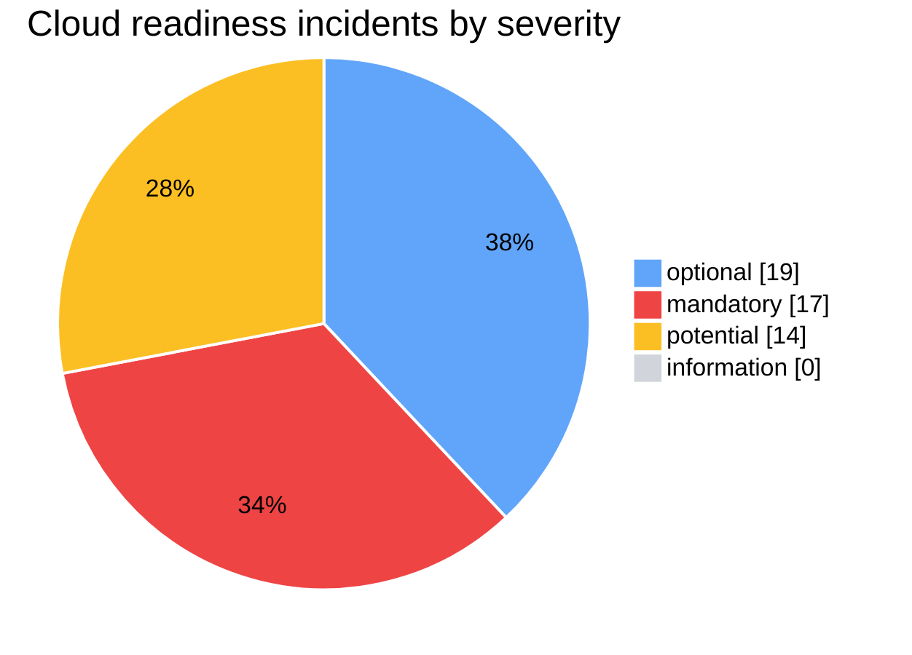
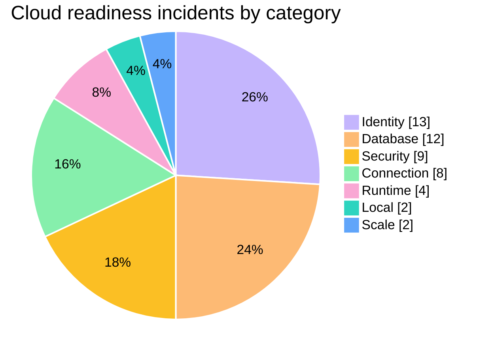
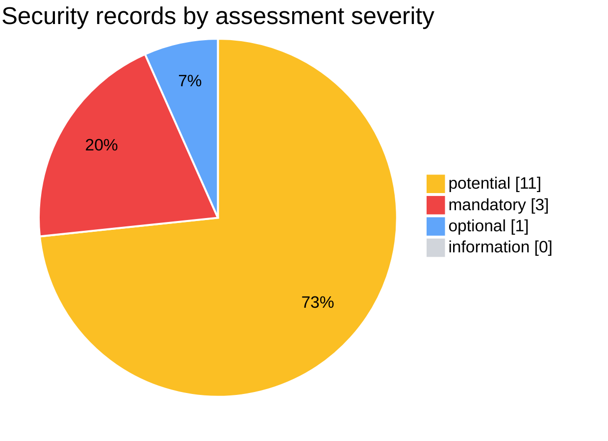
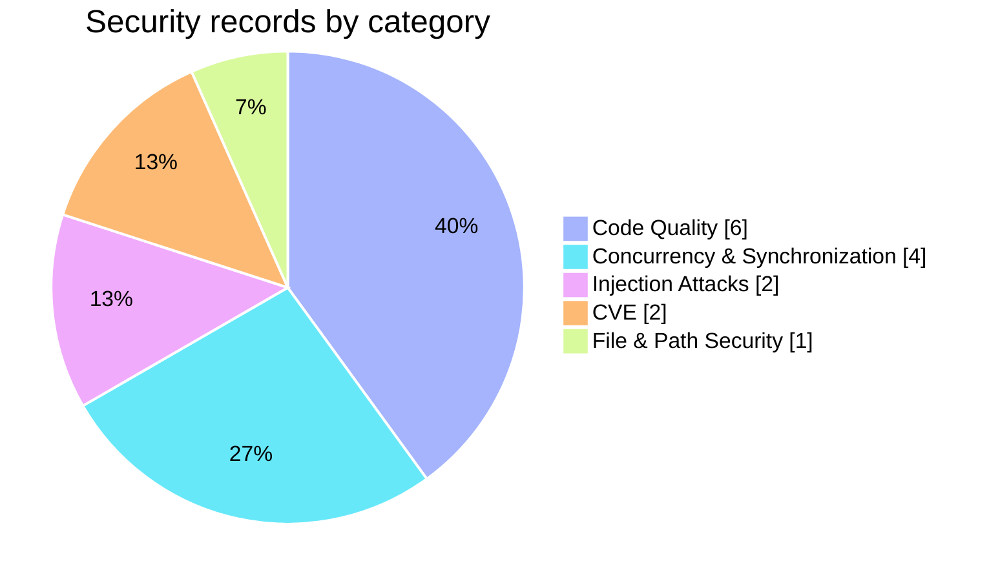
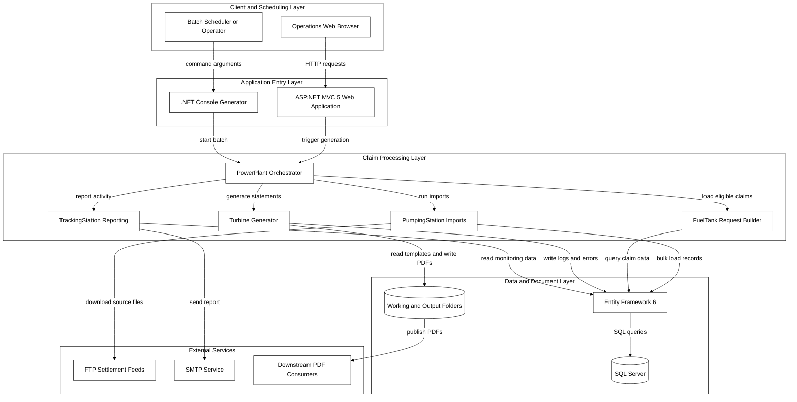
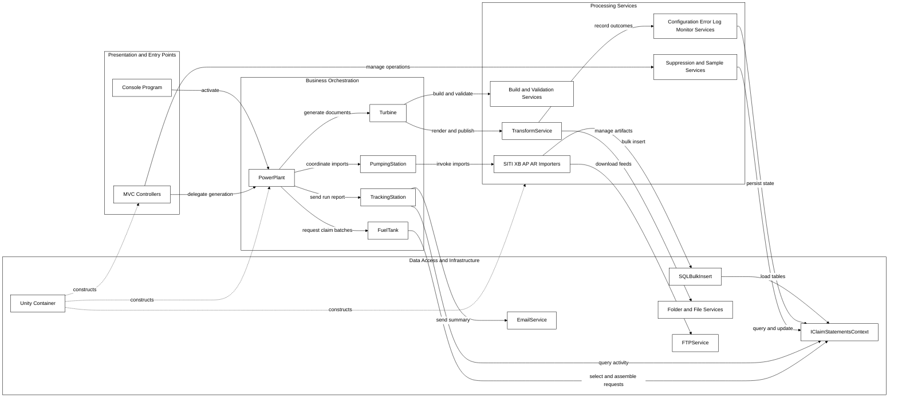
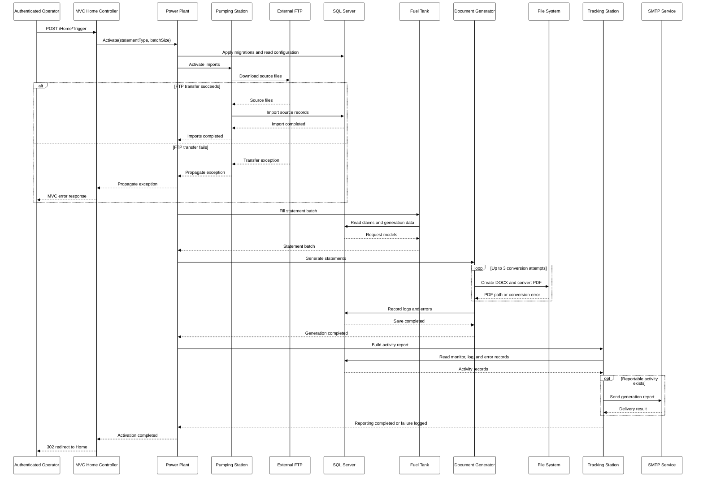
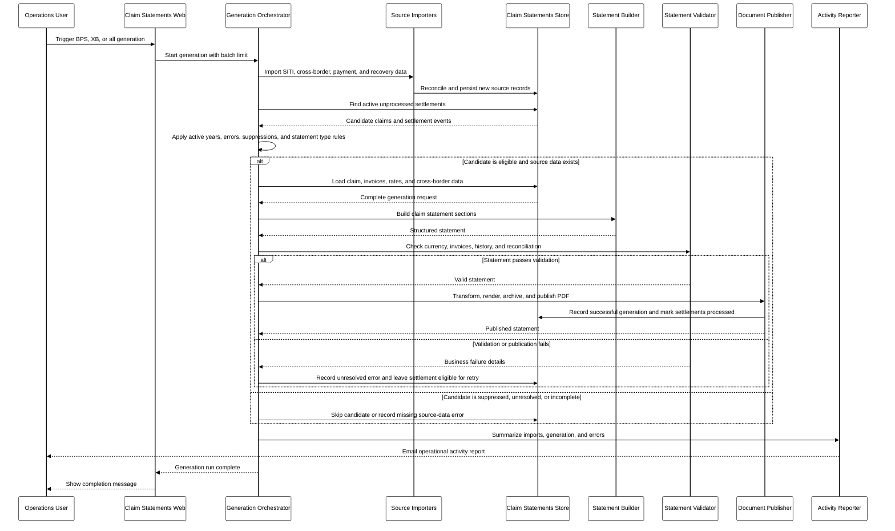

# Report_20261005164238

This is a consolidated Markdown export of two historical App Modernisation assessments of the RPA Claim Statements solution, both run on 2026-10-05 by the .NET AppCAT CLI (report format 1.0.0). It merges the cloud-readiness assessment `Report_20261005162854` with the security and cloud-readiness assessment `Report_20261005164238`, whose name this export uses. It is **not a fresh scan**: all findings, ratings, and analysis are reproduced from the stored artifacts in `.github/modernize/assessment/reports/report-20261005162854/` and `.github/modernize/assessment/reports/report-20261005164238/` (`report.json`, `solution.json`, and `facts/`). Formatting has been normalised; source content has not been re-evaluated.

## Contents

1. [Assessment Metadata](#assessment-metadata)
2. [Assessment Summary](#assessment-summary)
3. [Cloud Readiness Findings: Azure Container Apps](#cloud-readiness-findings-azure-container-apps)
4. [Security Findings](#security-findings)
5. [Migration Solution Mapping](#migration-solution-mapping)
6. [Supporting Analysis and Original Diagrams](#supporting-analysis-and-original-diagrams)
7. [Source Notes and Discrepancies](#source-notes-and-discrepancies)

## Assessment Metadata

- **Merged reports:** `Report_20261005162854` (ID `20261005162854`) and `Report_20261005164238` (ID `20261005164238`); this export is named after the later report
- **Format / producer:** report format 1.0.0, produced by .NET AppCAT CLI (both reports)
- **`Report_20261005162854`:** status completed; mode full; domains: cloud-readiness; 2026-10-05 14:28:54 UTC to 2026-10-05 14:36:07 UTC; supplies the cloud-readiness findings and all supporting analysis documents (`facts/`)
- **`Report_20261005164238`:** status completed; mode issue-only; domains: security, cloud-readiness; 2026-10-05 14:42:38 UTC to 2026-10-05 14:57:13 UTC; supplies the security findings and repeats the cloud-readiness findings; no `facts/` folder
- **Privacy:** Protected mode ([privacy mode help](https://aka.ms/appmod-privacy-mode)) in both reports
- **Selected target:** Azure Container Apps (`ACA`) in both reports; incidents additionally carry ratings for 8 target IDs
- **CVE scan:** minimum severity `high`; scope `direct` (both reports)
- **Capabilities:** None specified &middot; **Operating systems:** None specified (both reports)

## Assessment Summary

Cloud-readiness values are for the selected target, Azure Container Apps, and are identical in both source reports. Security values are counted from the `security` records in `Report_20261005164238`, because the source `summary` block covers cloud-readiness incidents only. Cloud-readiness and security effort are both expressed in story points but are kept separate.

| Group | Metric | Value |
|---|---|---:|
| Cloud readiness totals | Projects | 4 |
| Cloud readiness totals | Rule types (issues) | 8 |
| Cloud readiness totals | Incidents | 50 |
| Cloud readiness totals | Effort (story points) | 146 |
| Cloud readiness incidents by severity | mandatory | 17 |
| Cloud readiness incidents by severity | potential | 14 |
| Cloud readiness incidents by severity | optional | 19 |
| Cloud readiness incidents by severity | information | 0 |
| Cloud readiness incidents by category | Runtime | 4 |
| Cloud readiness incidents by category | Scale | 2 |
| Cloud readiness incidents by category | Connection | 8 |
| Cloud readiness incidents by category | Identity | 13 |
| Cloud readiness incidents by category | Security | 9 |
| Cloud readiness incidents by category | Database | 12 |
| Cloud readiness incidents by category | Local | 2 |
| Security totals | Security records | 15 |
| Security totals | CWE records | 13 |
| Security totals | CVE records | 2 |
| Security totals | Effort (story points) | 75 |
| Security records by assessment severity | mandatory | 3 |
| Security records by assessment severity | potential | 11 |
| Security records by assessment severity | optional | 1 |
| Security records by assessment severity | information | 0 |
| Security records by category | Code Quality | 6 |
| Security records by category | Concurrency & Synchronization | 4 |
| Security records by category | File & Path Security | 1 |
| Security records by category | Injection Attacks | 2 |
| Security records by category | CVE | 2 |

### Cloud Readiness Charts (Azure Container Apps)

Colour key: mandatory = red (17); potential = amber (14); optional = blue (19); information = grey (0).

Zero-count entries (information) are retained in the chart data but have no visible slice.

Colour key: Local = teal (2); Scale = blue (2); Identity = violet (13); Security = amber (9); Runtime = pink (4); Connection = green (8); Database = orange (12).

Category colours distinguish rule families only; they do not indicate severity.

### Security Charts

Security records use the same assessment severity scale (mandatory, potential, optional, information) and therefore the same severity colours.

Colour key: mandatory = red (3); potential = amber (11); optional = blue (1); information = grey (0).

Zero-count entries (information) are retained in the chart data but have no visible slice.

Colour key: Code Quality = indigo (6); Concurrency & Synchronization = cyan (4); File & Path Security = lime (1); Injection Attacks = fuchsia (2); CVE = orange (2).

Category colours distinguish security categories only; they do not indicate severity.

## Cloud Readiness Findings: Azure Container Apps

Severity and effort in this section are the Azure Container Apps (`ACA`) ratings unless a table states otherwise. Effort is in story points (SP). The source rule `severity` and `effort` fields are shown alongside the target-specific values. Internal incident IDs differ between the two source reports and are retained only in the source folders.

### Project Overview

| Project | Project file | Framework | Language | Build tool | Rule types | Incidents | Effort (SP) |
|---|---|---|---|---|---:|---:|---:|
| RPA.ClaimStatements.Generator | [RPA.ClaimStatements/RPA.ClaimStatements.Generator/RPA.ClaimStatements.Generator.csproj](../RPA.ClaimStatements/RPA.ClaimStatements.Generator/RPA.ClaimStatements.Generator.csproj) | .NETFramework,Version=v4.5 | C# | MSBuild | 5 | 14 | 42 |
| RPA.ClaimStatements.Generator.Tests | [RPA.ClaimStatements/RPA.ClaimStatements.Generator.Tests/RPA.ClaimStatements.Generator.Tests.csproj](../RPA.ClaimStatements/RPA.ClaimStatements.Generator.Tests/RPA.ClaimStatements.Generator.Tests.csproj) | .NETFramework,Version=v4.5 | C# | MSBuild | 1 | 1 | 3 |
| RPA.ClaimStatements.Web | [RPA.ClaimStatements/RPA.ClaimStatements.Web/RPA.ClaimStatements.Web.csproj](../RPA.ClaimStatements/RPA.ClaimStatements.Web/RPA.ClaimStatements.Web.csproj) | .NETFramework,Version=v4.5 | C# | MSBuild | 8 | 33 | 95 |
| RPA.ClaimStatements.Web.Tests | [RPA.ClaimStatements/RPA.ClaimStatements.Web.Tests/RPA.ClaimStatements.Web.Tests.csproj](../RPA.ClaimStatements/RPA.ClaimStatements.Web.Tests/RPA.ClaimStatements.Web.Tests.csproj) | .NETFramework,Version=v4.5 | C# | MSBuild | 2 | 2 | 6 |
| **Total** | | | | | 8 distinct | 50 | 146 |

The project `Rule types` column is the source per-project `issues` value (distinct rules found in that project); the total row is the source distinct-rule count, not a sum.

### Findings Overview

| Rule | Title | Category | Rule severity | ACA severity | Effort per incident (SP) | Incidents | Total effort (SP) | Projects |
|---|---|---|---|---|---:|---:|---:|---|
| [Runtime.0003](#runtime0003-old-net-framework-dependency-detected) | Old .NET Framework dependency detected | Runtime | mandatory | mandatory | 3 | 4 | 12 | RPA.ClaimStatements.Generator, RPA.ClaimStatements.Generator.Tests, RPA.ClaimStatements.Web, RPA.ClaimStatements.Web.Tests |
| [Scale.0001](#scale0001-static-content-detected) | Static content detected | Scale | optional | optional | 3 | 2 | 6 | RPA.ClaimStatements.Generator, RPA.ClaimStatements.Web |
| [Connection.0001](#connection0001-connection-string-is-detected) | Connection string is detected | Connection | potential | potential | 3 | 8 | 24 | RPA.ClaimStatements.Generator, RPA.ClaimStatements.Web |
| [Identity.0002](#identity0002-windows-authentication-detected) | Windows authentication detected | Identity | mandatory | mandatory | 3 | 13 | 39 | RPA.ClaimStatements.Generator, RPA.ClaimStatements.Web |
| [Security.0002](#security0002-connection-strings-without-configuration-builders-detected) | Connection strings without configuration builders detected | Security | optional | optional | 3 | 9 | 27 | RPA.ClaimStatements.Generator, RPA.ClaimStatements.Web, RPA.ClaimStatements.Web.Tests |
| [Database.0002](#database0002-sql-database-connection-detected) | SQL database connection detected | Database | potential | potential | 3 | 4 | 12 | RPA.ClaimStatements.Web |
| [Database.0003](#database0003-systemdatasqlclient-dependency-detected) | System.Data.SqlClient dependency detected | Database | optional | optional | 3 | 8 | 24 | RPA.ClaimStatements.Web |
| [Local.0006](#local0006-hardcoded-urls-detected) | Hardcoded URLs detected | Local | potential | potential | 1 | 2 | 2 | RPA.ClaimStatements.Web |
| **Total** | | | | | | 50 | 146 | |

### Rule Guidance and Incident Evidence

#### Runtime.0003 Old .NET Framework dependency detected

- **Rule severity / effort:** mandatory, 3 SP per incident
- **Labels:** None specified
- **Migration solution:** `runtime-compatibility-prompt`

Applications running on frameworks older than .NET Framework 4.8 could have potential compatibility issues.

If you are targeting Managed Instance on Azure App Service, run the app on .NET Framework 4.8 (preinstalled) without retargeting if feasible; review runtime breaking changes and validate on Managed Instance staging.

Azure App Service runs apps on .NET Framework 4.8 or .NET Framework 3.5. Upgrade to a newer target framework or double check that your application works correctly when running on .NET Framework 4.8.

Apps that already run on .NET Framework 3.5 or .NET Framework 4.8 do not need changed even if they target an older framework version.

Although retargeting to .NET Framework 4.8 will address this issue, it is not necessary. It is only necessary to ensure that the app runs correctly on .NET Framework 3.5 or .NET Framework 4.8. Applications built against older versions of the .NET Framework can run on newer versions (like 4.8) and the runtime will automatically tweak certain behaviors so that the runtime behaves as much as possible as the targeted version. Breaking change documentation mentions both runtime breaking changes and retargeting breaking changes. Runtime breaking changes refer to differences in behavior when applications are run on a newer version of the .NET Framework. These are the behavioral differences which cannot be tweaked away and will matter for applications migrating to Azure App Service. Retargeting breaking changes are changes which only manifest when an app targets a newer version of the .NET Framework. These should not cause issues during App Service migration scenarios because apps do not need re-targeted.

Actions to address this issue:
1. Review breaking changes between the version of the .NET Framework the application runs on now and .NET Framework 4.8 to make sure none are likely to affect the application.
2. Test the application running on .NET Framework 3.5 or .NET Framework 4.8 to ensure it works as expected.

**References:**

- [.NET Framework Breaking Changes](https://go.microsoft.com/fwlink/?linkid=2250029)
- [.NET Framework 4.8 on App Service](https://go.microsoft.com/fwlink/?linkid=2251730)
- [Configuration builders for ASP.NET](https://go.microsoft.com/fwlink/?linkid=2251829)

**Target ratings** (identical for every incident of this rule):

| Target ID | Severity | Effort (SP) |
|---|---|---:|
| `AppService.Windows` | potential | 3 |
| `AppService.Linux` | mandatory | 3 |
| `AKS.Linux` | mandatory | 3 |
| `AKS.Windows` | potential | 3 |
| `ACA` (Azure Container Apps, selected) | mandatory | 3 |
| `AppServiceContainer.Linux` | mandatory | 3 |
| `AppServiceContainer.Windows` | potential | 3 |
| `AppServiceManagedInstance.Windows` | potential | 3 |

**Incidents (4):**

| # | Project | Location | Evidence |
|---:|---|---|---|
| 1 | RPA.ClaimStatements.Generator | [RPA.ClaimStatements/RPA.ClaimStatements.Generator/RPA.ClaimStatements.Generator.csproj](../RPA.ClaimStatements/RPA.ClaimStatements.Generator/RPA.ClaimStatements.Generator.csproj) | <code>Target framework: .NETFramework,Version=v4.5</code> |
| 2 | RPA.ClaimStatements.Generator.Tests | [RPA.ClaimStatements/RPA.ClaimStatements.Generator.Tests/RPA.ClaimStatements.Generator.Tests.csproj](../RPA.ClaimStatements/RPA.ClaimStatements.Generator.Tests/RPA.ClaimStatements.Generator.Tests.csproj) | <code>Target framework: .NETFramework,Version=v4.5</code> |
| 3 | RPA.ClaimStatements.Web | [RPA.ClaimStatements/RPA.ClaimStatements.Web/RPA.ClaimStatements.Web.csproj](../RPA.ClaimStatements/RPA.ClaimStatements.Web/RPA.ClaimStatements.Web.csproj) | <code>Target framework: .NETFramework,Version=v4.5</code> |
| 4 | RPA.ClaimStatements.Web.Tests | [RPA.ClaimStatements/RPA.ClaimStatements.Web.Tests/RPA.ClaimStatements.Web.Tests.csproj](../RPA.ClaimStatements/RPA.ClaimStatements.Web.Tests/RPA.ClaimStatements.Web.Tests.csproj) | <code>Target framework: .NETFramework,Version=v4.5</code> |

#### Scale.0001 Static content detected

- **Rule severity / effort:** optional, 3 SP per incident
- **Labels:** None specified
- **Migration solution:** `local-file-to-azure-blob-storage`

Static content detected.

Your current approach of serving static content directly might lead to increased costs, performance issues, maintenance challenges (requiring application redeployment for content changes), and security risks.

Consider moving static content to Azure Blob Storage and adding Azure CDN.

**References:**

- [Azure Blob Storage](https://go.microsoft.com/fwlink/?linkid=2250574)
- [Azure CDN](https://go.microsoft.com/fwlink/?linkid=2250392)

**Target ratings** (identical for every incident of this rule):

| Target ID | Severity | Effort (SP) |
|---|---|---:|
| `AppService.Windows` | optional | 3 |
| `AppService.Linux` | optional | 3 |
| `AKS.Linux` | optional | 3 |
| `AKS.Windows` | optional | 3 |
| `ACA` (Azure Container Apps, selected) | optional | 3 |
| `AppServiceContainer.Linux` | optional | 3 |
| `AppServiceContainer.Windows` | optional | 3 |
| `AppServiceManagedInstance.Windows` | optional | 3 |

**Incidents (2):**

| # | Project | Location | Evidence |
|---:|---|---|---|
| 1 | RPA.ClaimStatements.Generator | [RPA.ClaimStatements/RPA.ClaimStatements.Generator/RPA.ClaimStatements.Generator.csproj](../RPA.ClaimStatements/RPA.ClaimStatements.Generator/RPA.ClaimStatements.Generator.csproj) | <code>Found 1 files matching the rule:  Icon.ico</code> |
| 2 | RPA.ClaimStatements.Web | [RPA.ClaimStatements/RPA.ClaimStatements.Web/RPA.ClaimStatements.Web.csproj](../RPA.ClaimStatements/RPA.ClaimStatements.Web/RPA.ClaimStatements.Web.csproj) | <code>Found 28 files matching the rule:  Content&#92;bootstrap-theme.css Content&#92;bootstrap-theme.min.css Content&#92;bootstrap.css Content&#92;bootstrap.min.css Content&#92;PagedList.css Content&#92;Site.css fonts&#92;glyphicons-halflings-regular.eot fonts&#92;glyphicons-halflings-regular.svg fonts&#92;glyphicons-halflings-regular.ttf fonts&#92;glyphicons-halflings-regular.woff images&#92;Generator.jpg images&#92;icon&#95;inverted-6.png images&#92;Icon.ico images&#92;Sheep.jpg Scripts&#92;&#95;references.js Scripts&#92;bootstrap.js Scripts&#92;bootstrap.min.js Scripts&#92;jquery-1.10.2.js Scripts&#92;jquery-1.10.2.min.js Scripts&#92;jquery.unobtrusive-ajax.js Scripts&#92;jquery.unobtrusive-ajax.min.js Scripts&#92;jquery.validate.js Scripts&#92;jquery.validate.min.js Scripts&#92;jquery.validate.unobtrusive.js Scripts&#92;jquery.validate.unobtrusive.min.js Scripts&#92;modernizr-2.6.2.js Scripts&#92;respond.js Scripts&#92;respond.min.js</code> |

#### Connection.0001 Connection string is detected

- **Rule severity / effort:** potential, 3 SP per incident
- **Labels:** None specified
- **Migration solution:** `plaintext-credential-to-azure-keyvault`

Connection string detected. It may not be available when your app is migrated to Azure.

Review and ensure it works from Azure. If you are connecting to a database, you might need to migrate the database to Azure. There are multiple ways to do it:
1. Migrate to Azure SQL Database for additional benefits (see the link below).
2. Consider Azure SQL Managed Instance if you need features that are not available in Azure SQL Database and you don’t want to use a VM.
3. Migrate your database servers directly to SQL Server on Azure VMs.

To assess database migration effort, you can use Azure Migrate tool, see the link below.

**References:**

- [Migrate SQL Server database to Azure](https://go.microsoft.com/fwlink/?LinkID=2251731)
- [Azure SQL Managed Instance](https://go.microsoft.com/fwlink/?LinkID=2251613)
- [Azure Migrate](https://go.microsoft.com/fwlink/?linkid=2252410)

**Target ratings** (identical for every incident of this rule):

| Target ID | Severity | Effort (SP) |
|---|---|---:|
| `AppService.Windows` | potential | 3 |
| `AppService.Linux` | potential | 3 |
| `AKS.Linux` | potential | 3 |
| `AKS.Windows` | potential | 3 |
| `ACA` (Azure Container Apps, selected) | potential | 3 |
| `AppServiceContainer.Linux` | potential | 3 |
| `AppServiceContainer.Windows` | potential | 3 |
| `AppServiceManagedInstance.Windows` | potential | 3 |

**Incidents (8):**

| # | Project | Location | Evidence |
|---:|---|---|---|
| 1 | RPA.ClaimStatements.Generator | [RPA.ClaimStatements/RPA.ClaimStatements.Generator/App.config](../RPA.ClaimStatements/RPA.ClaimStatements.Generator/App.config) | <code>&lt;add name="ClaimStatementsContext" /&gt;</code> |
| 2 | RPA.ClaimStatements.Generator | [RPA.ClaimStatements/RPA.ClaimStatements.Generator/App.Production.config](../RPA.ClaimStatements/RPA.ClaimStatements.Generator/App.Production.config) | <code>&lt;add name="ClaimStatementsContext" /&gt;</code> |
| 3 | RPA.ClaimStatements.Generator | [RPA.ClaimStatements/RPA.ClaimStatements.Generator/App.SIT.config](../RPA.ClaimStatements/RPA.ClaimStatements.Generator/App.SIT.config) | <code>&lt;add name="ClaimStatementsContext" /&gt;</code> |
| 4 | RPA.ClaimStatements.Generator | [RPA.ClaimStatements/RPA.ClaimStatements.Generator/App.UAT.config](../RPA.ClaimStatements/RPA.ClaimStatements.Generator/App.UAT.config) | <code>&lt;add name="ClaimStatementsContext" /&gt;</code> |
| 5 | RPA.ClaimStatements.Web | [RPA.ClaimStatements/RPA.ClaimStatements.Web/Web.config](../RPA.ClaimStatements/RPA.ClaimStatements.Web/Web.config) | <code>&lt;add name="ClaimStatementsContext" /&gt;</code> |
| 6 | RPA.ClaimStatements.Web | [RPA.ClaimStatements/RPA.ClaimStatements.Web/Web.Production.config](../RPA.ClaimStatements/RPA.ClaimStatements.Web/Web.Production.config) | <code>&lt;add name="ClaimStatementsContext" /&gt;</code> |
| 7 | RPA.ClaimStatements.Web | [RPA.ClaimStatements/RPA.ClaimStatements.Web/Web.SIT.config](../RPA.ClaimStatements/RPA.ClaimStatements.Web/Web.SIT.config) | <code>&lt;add name="ClaimStatementsContext" /&gt;</code> |
| 8 | RPA.ClaimStatements.Web | [RPA.ClaimStatements/RPA.ClaimStatements.Web/Web.UAT.config](../RPA.ClaimStatements/RPA.ClaimStatements.Web/Web.UAT.config) | <code>&lt;add name="ClaimStatementsContext" /&gt;</code> |

#### Identity.0002 Windows authentication detected

- **Rule severity / effort:** mandatory, 3 SP per incident
- **Labels:** None specified
- **Migration solution:** `windows-ad-to-azure-ad`

Your app is using windows authentication which is not supported on Azure App Service, Azure Container Apps and Azure Kubernetes Service.

Azure App Service provides built-in authentication and authorization capabilities, so you can sign in users and access data by writing minimal or no code in your web app.

Follow the link below for more information."

**References:**

- [https://go.microsoft.com/fwlink/?LinkID=2242883](https://go.microsoft.com/fwlink/?LinkID=2242883) (untitled in source)

**Target ratings** (identical for every incident of this rule):

| Target ID | Severity | Effort (SP) |
|---|---|---:|
| `AppService.Windows` | mandatory | 3 |
| `AppService.Linux` | mandatory | 3 |
| `AKS.Linux` | mandatory | 3 |
| `AKS.Windows` | potential | 3 |
| `ACA` (Azure Container Apps, selected) | mandatory | 3 |
| `AppServiceContainer.Linux` | mandatory | 3 |
| `AppServiceContainer.Windows` | mandatory | 3 |
| `AppServiceManagedInstance.Windows` | mandatory | 3 |

**Incidents (13):**

| # | Project | Location | Evidence |
|---:|---|---|---|
| 1 | RPA.ClaimStatements.Generator | [RPA.ClaimStatements/RPA.ClaimStatements.Generator/App.config](../RPA.ClaimStatements/RPA.ClaimStatements.Generator/App.config) | <code>&lt;add name="ClaimStatementsContext" /&gt;</code> |
| 2 | RPA.ClaimStatements.Generator | [RPA.ClaimStatements/RPA.ClaimStatements.Generator/App.Production.config](../RPA.ClaimStatements/RPA.ClaimStatements.Generator/App.Production.config) | <code>&lt;add name="ClaimStatementsContext" /&gt;</code> |
| 3 | RPA.ClaimStatements.Generator | [RPA.ClaimStatements/RPA.ClaimStatements.Generator/App.SIT.config](../RPA.ClaimStatements/RPA.ClaimStatements.Generator/App.SIT.config) | <code>&lt;add name="ClaimStatementsContext" /&gt;</code> |
| 4 | RPA.ClaimStatements.Generator | [RPA.ClaimStatements/RPA.ClaimStatements.Generator/App.UAT.config](../RPA.ClaimStatements/RPA.ClaimStatements.Generator/App.UAT.config) | <code>&lt;add name="ClaimStatementsContext" /&gt;</code> |
| 5 | RPA.ClaimStatements.Web | [RPA.ClaimStatements/RPA.ClaimStatements.Web/Web.config](../RPA.ClaimStatements/RPA.ClaimStatements.Web/Web.config) | <code>&lt;add name="ClaimStatementsContext" /&gt;</code> |
| 6 | RPA.ClaimStatements.Web | [RPA.ClaimStatements/RPA.ClaimStatements.Web/Web.config](../RPA.ClaimStatements/RPA.ClaimStatements.Web/Web.config) | <code>&lt;add name="IDTSecurityConnection" /&gt;</code> |
| 7 | RPA.ClaimStatements.Web | [RPA.ClaimStatements/RPA.ClaimStatements.Web/Web.config](../RPA.ClaimStatements/RPA.ClaimStatements.Web/Web.config) | <code>&lt;authentication /&gt;</code> |
| 8 | RPA.ClaimStatements.Web | [RPA.ClaimStatements/RPA.ClaimStatements.Web/Web.Production.config](../RPA.ClaimStatements/RPA.ClaimStatements.Web/Web.Production.config) | <code>&lt;add name="ClaimStatementsContext" /&gt;</code> |
| 9 | RPA.ClaimStatements.Web | [RPA.ClaimStatements/RPA.ClaimStatements.Web/Web.Production.config](../RPA.ClaimStatements/RPA.ClaimStatements.Web/Web.Production.config) | <code>&lt;add name="IDTSecurityConnection" /&gt;</code> |
| 10 | RPA.ClaimStatements.Web | [RPA.ClaimStatements/RPA.ClaimStatements.Web/Web.SIT.config](../RPA.ClaimStatements/RPA.ClaimStatements.Web/Web.SIT.config) | <code>&lt;add name="ClaimStatementsContext" /&gt;</code> |
| 11 | RPA.ClaimStatements.Web | [RPA.ClaimStatements/RPA.ClaimStatements.Web/Web.SIT.config](../RPA.ClaimStatements/RPA.ClaimStatements.Web/Web.SIT.config) | <code>&lt;add name="IDTSecurityConnection" /&gt;</code> |
| 12 | RPA.ClaimStatements.Web | [RPA.ClaimStatements/RPA.ClaimStatements.Web/Web.UAT.config](../RPA.ClaimStatements/RPA.ClaimStatements.Web/Web.UAT.config) | <code>&lt;add name="ClaimStatementsContext" /&gt;</code> |
| 13 | RPA.ClaimStatements.Web | [RPA.ClaimStatements/RPA.ClaimStatements.Web/Web.UAT.config](../RPA.ClaimStatements/RPA.ClaimStatements.Web/Web.UAT.config) | <code>&lt;add name="IDTSecurityConnection" /&gt;</code> |

#### Security.0002 Connection strings without configuration builders detected

- **Rule severity / effort:** optional, 3 SP per incident
- **Labels:** None specified
- **Migration solution:** `plaintext-credential-to-azure-keyvault`

Connection strings without configuration builders detected.

Keeping connection strings directly in the app is not the best practice and might introduce security risks, increased maintenance, scalability challenges or compliance standards (such as PCI DSS, GDPR, etc.).

Instead, it is recommended to use configuration builders to get secrets from secure sources in Azure environment.

**References:**

- [Configuration builders](https://go.microsoft.com/fwlink/?LinkID=2250915)
- [Storing application secrets](https://go.microsoft.com/fwlink/?LinkID=2250916)
- [Centralized app configuration and security](https://go.microsoft.com/fwlink/?LinkID=2250733)

**Target ratings** (identical for every incident of this rule):

| Target ID | Severity | Effort (SP) |
|---|---|---:|
| `AppService.Windows` | optional | 3 |
| `AppService.Linux` | optional | 3 |
| `AKS.Linux` | optional | 3 |
| `AKS.Windows` | optional | 3 |
| `ACA` (Azure Container Apps, selected) | optional | 3 |
| `AppServiceContainer.Linux` | optional | 3 |
| `AppServiceContainer.Windows` | optional | 3 |
| `AppServiceManagedInstance.Windows` | optional | 3 |

**Incidents (9):**

| # | Project | Location | Evidence |
|---:|---|---|---|
| 1 | RPA.ClaimStatements.Generator | [RPA.ClaimStatements/RPA.ClaimStatements.Generator/App.config](../RPA.ClaimStatements/RPA.ClaimStatements.Generator/App.config) | <code>&lt;connectionStrings /&gt;</code> |
| 2 | RPA.ClaimStatements.Generator | [RPA.ClaimStatements/RPA.ClaimStatements.Generator/App.Production.config](../RPA.ClaimStatements/RPA.ClaimStatements.Generator/App.Production.config) | <code>&lt;connectionStrings /&gt;</code> |
| 3 | RPA.ClaimStatements.Generator | [RPA.ClaimStatements/RPA.ClaimStatements.Generator/App.SIT.config](../RPA.ClaimStatements/RPA.ClaimStatements.Generator/App.SIT.config) | <code>&lt;connectionStrings /&gt;</code> |
| 4 | RPA.ClaimStatements.Generator | [RPA.ClaimStatements/RPA.ClaimStatements.Generator/App.UAT.config](../RPA.ClaimStatements/RPA.ClaimStatements.Generator/App.UAT.config) | <code>&lt;connectionStrings /&gt;</code> |
| 5 | RPA.ClaimStatements.Web | [RPA.ClaimStatements/RPA.ClaimStatements.Web/Web.config](../RPA.ClaimStatements/RPA.ClaimStatements.Web/Web.config) | <code>&lt;connectionStrings /&gt;</code> |
| 6 | RPA.ClaimStatements.Web | [RPA.ClaimStatements/RPA.ClaimStatements.Web/Web.Production.config](../RPA.ClaimStatements/RPA.ClaimStatements.Web/Web.Production.config) | <code>&lt;connectionStrings /&gt;</code> |
| 7 | RPA.ClaimStatements.Web | [RPA.ClaimStatements/RPA.ClaimStatements.Web/Web.SIT.config](../RPA.ClaimStatements/RPA.ClaimStatements.Web/Web.SIT.config) | <code>&lt;connectionStrings /&gt;</code> |
| 8 | RPA.ClaimStatements.Web | [RPA.ClaimStatements/RPA.ClaimStatements.Web/Web.UAT.config](../RPA.ClaimStatements/RPA.ClaimStatements.Web/Web.UAT.config) | <code>&lt;connectionStrings /&gt;</code> |
| 9 | RPA.ClaimStatements.Web.Tests | [RPA.ClaimStatements/RPA.ClaimStatements.Web.Tests/App.config](../RPA.ClaimStatements/RPA.ClaimStatements.Web.Tests/App.config) | <code>&lt;connectionStrings /&gt;</code> |

#### Database.0002 SQL database connection detected

- **Rule severity / effort:** potential, 3 SP per incident
- **Labels:** None specified
- **Migration solution:** `local-sql-server-to-azure-sql-db`

SQL database connection detected.

Ensure the database is available/reachable on Azure.

If it is not, there are multiple ways you can move your data to Azure:
1. Migrate to Azure SQL Database.
2. Consider Azure SQL Managed Instance if you need features that are not available in Azure SQL Database and you don’t want to use a VM.
3. Migrate your database servers directly to SQL Server on Azure VMs.

To assess database migration effort, you can use Azure Migrate tool, see the link below.

**References:**

- [Migrate SQL Server database to Azure](https://go.microsoft.com/fwlink/?LinkID=2251731)
- [Azure SQL Managed Instance](https://go.microsoft.com/fwlink/?LinkID=2251613)
- [Azure Migrate](https://go.microsoft.com/fwlink/?linkid=2252410)

**Target ratings** (identical for every incident of this rule):

| Target ID | Severity | Effort (SP) |
|---|---|---:|
| `AppService.Windows` | potential | 3 |
| `AppService.Linux` | potential | 3 |
| `AKS.Linux` | potential | 3 |
| `AKS.Windows` | potential | 3 |
| `ACA` (Azure Container Apps, selected) | potential | 3 |
| `AppServiceContainer.Linux` | potential | 3 |
| `AppServiceContainer.Windows` | potential | 3 |
| `AppServiceManagedInstance.Windows` | potential | 3 |

**Incidents (4):**

| # | Project | Location | Evidence |
|---:|---|---|---|
| 1 | RPA.ClaimStatements.Web | [RPA.ClaimStatements/RPA.ClaimStatements.Web/Web.config](../RPA.ClaimStatements/RPA.ClaimStatements.Web/Web.config) | <code>&lt;add name="IDTSecurityConnection" /&gt;</code> |
| 2 | RPA.ClaimStatements.Web | [RPA.ClaimStatements/RPA.ClaimStatements.Web/Web.Production.config](../RPA.ClaimStatements/RPA.ClaimStatements.Web/Web.Production.config) | <code>&lt;add name="IDTSecurityConnection" /&gt;</code> |
| 3 | RPA.ClaimStatements.Web | [RPA.ClaimStatements/RPA.ClaimStatements.Web/Web.SIT.config](../RPA.ClaimStatements/RPA.ClaimStatements.Web/Web.SIT.config) | <code>&lt;add name="IDTSecurityConnection" /&gt;</code> |
| 4 | RPA.ClaimStatements.Web | [RPA.ClaimStatements/RPA.ClaimStatements.Web/Web.UAT.config](../RPA.ClaimStatements/RPA.ClaimStatements.Web/Web.UAT.config) | <code>&lt;add name="IDTSecurityConnection" /&gt;</code> |

#### Database.0003 System.Data.SqlClient dependency detected

- **Rule severity / effort:** optional, 3 SP per incident
- **Labels:** None specified
- **Migration solution:** `sqlclient-system-to-microsoft`

System.Data.SqlClient dependency is detected.

While System.Data.SqlClient will work in Azure, the newer Microsoft.Data.SqlClient package is the primary .NET SQL client moving forward and receiving the latest features. For example, Microsoft.Data.SqlClient easily allows use of Azure Managed Identity from a connection string.

**References:**

- [https://go.microsoft.com/fwlink/?LinkID=2242668](https://go.microsoft.com/fwlink/?LinkID=2242668) (untitled in source)

**Target ratings** (identical for every incident of this rule):

| Target ID | Severity | Effort (SP) |
|---|---|---:|
| `AppService.Windows` | optional | 3 |
| `AppService.Linux` | optional | 3 |
| `AKS.Linux` | optional | 3 |
| `AKS.Windows` | optional | 3 |
| `ACA` (Azure Container Apps, selected) | optional | 3 |
| `AppServiceContainer.Linux` | optional | 3 |
| `AppServiceContainer.Windows` | optional | 3 |
| `AppServiceManagedInstance.Windows` | optional | 3 |

**Incidents (8):**

| # | Project | Location | Evidence |
|---:|---|---|---|
| 1 | RPA.ClaimStatements.Web | [RPA.ClaimStatements/RPA.ClaimStatements.Web/Web.config](../RPA.ClaimStatements/RPA.ClaimStatements.Web/Web.config) | <code>&lt;add name="ClaimStatementsContext" /&gt;</code> |
| 2 | RPA.ClaimStatements.Web | [RPA.ClaimStatements/RPA.ClaimStatements.Web/Web.config](../RPA.ClaimStatements/RPA.ClaimStatements.Web/Web.config) | <code>&lt;add name="IDTSecurityConnection" /&gt;</code> |
| 3 | RPA.ClaimStatements.Web | [RPA.ClaimStatements/RPA.ClaimStatements.Web/Web.Production.config](../RPA.ClaimStatements/RPA.ClaimStatements.Web/Web.Production.config) | <code>&lt;add name="ClaimStatementsContext" /&gt;</code> |
| 4 | RPA.ClaimStatements.Web | [RPA.ClaimStatements/RPA.ClaimStatements.Web/Web.Production.config](../RPA.ClaimStatements/RPA.ClaimStatements.Web/Web.Production.config) | <code>&lt;add name="IDTSecurityConnection" /&gt;</code> |
| 5 | RPA.ClaimStatements.Web | [RPA.ClaimStatements/RPA.ClaimStatements.Web/Web.SIT.config](../RPA.ClaimStatements/RPA.ClaimStatements.Web/Web.SIT.config) | <code>&lt;add name="ClaimStatementsContext" /&gt;</code> |
| 6 | RPA.ClaimStatements.Web | [RPA.ClaimStatements/RPA.ClaimStatements.Web/Web.SIT.config](../RPA.ClaimStatements/RPA.ClaimStatements.Web/Web.SIT.config) | <code>&lt;add name="IDTSecurityConnection" /&gt;</code> |
| 7 | RPA.ClaimStatements.Web | [RPA.ClaimStatements/RPA.ClaimStatements.Web/Web.UAT.config](../RPA.ClaimStatements/RPA.ClaimStatements.Web/Web.UAT.config) | <code>&lt;add name="ClaimStatementsContext" /&gt;</code> |
| 8 | RPA.ClaimStatements.Web | [RPA.ClaimStatements/RPA.ClaimStatements.Web/Web.UAT.config](../RPA.ClaimStatements/RPA.ClaimStatements.Web/Web.UAT.config) | <code>&lt;add name="IDTSecurityConnection" /&gt;</code> |

#### Local.0006 Hardcoded URLs detected

- **Rule severity / effort:** potential, 1 SP per incident
- **Labels:** None specified
- **Migration solution:** `configuration-management-prompt`

Your application has hardcoded URLs that might correspond to services that are not accessible on Azure.

Review and ensure that the application is attempting to access URLs that would be available from Azure. You might need to migrate those services to Azure too, this way you will get the benefit of lower latency in the cloud.

If your application needs to depend on services that run on-premises, you can connect your Azure and local networks with ExpressRoute, Hybrid Connections, or VPN solutions.

**References:**

- [ExpressRoute](https://go.microsoft.com/fwlink/?LinkID=2250577)
- [Hybrid Connections](https://go.microsoft.com/fwlink/?LinkID=2242588)
- [Connect an on-prem network](https://go.microsoft.com/fwlink/?LinkID=2242591)

**Target ratings** (identical for every incident of this rule):

| Target ID | Severity | Effort (SP) |
|---|---|---:|
| `AppService.Windows` | potential | 1 |
| `AppService.Linux` | potential | 1 |
| `AKS.Linux` | potential | 1 |
| `AKS.Windows` | potential | 1 |
| `ACA` (Azure Container Apps, selected) | potential | 1 |
| `AppServiceContainer.Linux` | potential | 1 |
| `AppServiceContainer.Windows` | potential | 1 |
| `AppServiceManagedInstance.Windows` | potential | 1 |

**Incidents (2):**

| # | Project | Location | Evidence |
|---:|---|---|---|
| 1 | RPA.ClaimStatements.Web | [RPA.ClaimStatements/RPA.ClaimStatements.Web/App\_Start/BundleConfig.cs:12:41](../RPA.ClaimStatements/RPA.ClaimStatements.Web/App_Start/BundleConfig.cs#L12) | <code>https://</code> |
| 2 | RPA.ClaimStatements.Web | [RPA.ClaimStatements/RPA.ClaimStatements.Web/App\_Start/BundleConfig.cs:13:43](../RPA.ClaimStatements/RPA.ClaimStatements.Web/App_Start/BundleConfig.cs#L13) | <code>http://</code> |

## Security Findings

All 15 security records come from `Report_20261005164238` (13 CWE records and 2 CVE records), in source order. **Assessment severity** is the assessment tool's rating on the mandatory/potential/optional scale. It is distinct from any severity stated in the evidence explanation or by the CVE advisory (for example "Medium severity" or "Severity: HIGH"), which is reproduced verbatim inside the Description and Evidence columns and tabulated separately below. Evidence files are linked relative to this report; line suffixes link to the cited line.

| ID | Title | Category | Assessment severity | Description | Files | Evidence | Effort (Story Points) |
|---|---|---|---|---|---|---|---:|
| [CWE-606](https://cwe.mitre.org/data/definitions/606.html) | Unchecked Input for Loop Condition | Code Quality | potential | The product does not properly check inputs that are used for loop conditions, potentially leading to a denial of service or other consequences because of excessive looping. | [RPA.ClaimStatements/RPA.ClaimStatements.Web/Controllers/SuppressionController.cs](../RPA.ClaimStatements/RPA.ClaimStatements.Web/Controllers/SuppressionController.cs) [RPA.ClaimStatements/RPA.ClaimStatements.Web/Services/SuppressionService.cs](../RPA.ClaimStatements/RPA.ClaimStatements.Web/Services/SuppressionService.cs) | Medium severity; high confidence. SuppressionController.\_BulkSuppression at lines 112-117 accepts an uploaded workbook from a user with the Manage Suppressions role and passes it to SuppressionService.BulkUpdate. BulkData at lines 48-95 uses workbook-controlled ws.Dimension.End.Column and ws.Dimension.End.Row directly as loop bounds at lines 62, 76 and 81, without application row, column or work limits. A sparse workbook with a distant populated cell can force traversal of a very large rectangular range, consuming worker time despite a small compressed upload. Verified by source inspection; runtime exhaustion was not tested. | 3 |
| [CWE-665](https://cwe.mitre.org/data/definitions/665.html) | Improper Initialization | Code Quality | potential | The product does not initialize or incorrectly initializes a resource, which might leave the resource in an unexpected state when it is accessed or used. | [RPA.ClaimStatements/RPA.ClaimStatements.Generator/Components/PumpingStation/ARImportService.cs](../RPA.ClaimStatements/RPA.ClaimStatements.Generator/Components/PumpingStation/ARImportService.cs) | Medium severity; high confidence. ARImportService.ImportAR initializes arTable once at line 70, outside the per-file loop at line 85, then initializes the same table's columns again at lines 98-106 and appends rows at lines 114-117 for each file. There is no per-file reset or replacement. When two normal input workbooks have the expected matching headers, the second attempts to add column1 and the other already-existing column names, raising DuplicateNameException and aborting the remaining import through the catch at lines 146-149. The resource therefore enters subsequent file processing with stale schema and rows. | 3 |
| [CWE-682](https://cwe.mitre.org/data/definitions/682.html) | Incorrect Calculation | Code Quality | potential | The product performs a calculation that generates incorrect or unintended results that are later used in security-critical decisions or resource management. | [RPA.ClaimStatements/RPA.ClaimStatements.Generator/Models/ClaimStatements/ProgressiveReductionsReduction.cs](../RPA.ClaimStatements/RPA.ClaimStatements.Generator/Models/ClaimStatements/ProgressiveReductionsReduction.cs) [RPA.ClaimStatements/RPA.ClaimStatements.Generator/Components/PumpingStation/Serializer/SITISerializer.cs](../RPA.ClaimStatements/RPA.ClaimStatements.Generator/Components/PumpingStation/Serializer/SITISerializer.cs) [RPA.ClaimStatements/RPA.ClaimStatements.Generator/Components/Turbine/BuildService.cs](../RPA.ClaimStatements/RPA.ClaimStatements.Generator/Components/Turbine/BuildService.cs) | Medium severity; high confidence. ProgressiveReductionsReduction.Build at lines 46-64 divides each imported band result by its percentage at lines 51, 55, 59 and 63 without checking for a zero denominator. SITISerializer.DeSerialize at lines 272-287 explicitly accepts zero or missing band percentages as zero, while BuildService.Build at lines 33-36 and 50-53 gates this calculation only on positive PRBTotalResult, not on all band percentages being nonzero. An imported record with a positive overall reduction and a zero percentage in any band therefore causes decimal DivideByZeroException and prevents that claim statement from being generated. Verified by source data flow; no live import was executed. | 5 |
| [CWE-772](https://cwe.mitre.org/data/definitions/772.html) | Missing Release of Resource after Effective Lifetime | Code Quality | potential | The product does not release a resource after its effective lifetime has ended, i.e., after the resource is no longer needed. | [RPA.ClaimStatements/RPA.ClaimStatements.Generator/Components/TrackingStation/EmailService.cs](../RPA.ClaimStatements/RPA.ClaimStatements.Generator/Components/TrackingStation/EmailService.cs) | Low severity; high confidence. EmailService.Send at lines 35-51 creates disposable MailMessage and SmtpClient objects at lines 39 and 49, calls client.Send at line 50, and exits without disposing either object on success or failure. EmailService.Dispose at lines 55-70 disposes only the database context and cannot release these method-local objects. SMTP connection and message resources consequently lack deterministic release at the end of their effective lifetime. Actual connection retention and exhaustion were not measured. | 3 |
| [CWE-775](https://cwe.mitre.org/data/definitions/775.html) | Missing Release of File Descriptor or Handle after Effective Lifetime | Code Quality | potential | The product does not release a file descriptor or handle after its effective lifetime has ended, i.e., after the file descriptor/handle is no longer needed. | [RPA.ClaimStatements/RPA.ClaimStatements.Generator/Components/PowerPlant.cs](../RPA.ClaimStatements/RPA.ClaimStatements.Generator/Components/PowerPlant.cs) | Low severity; high confidence. PowerPlant.Activate creates a method-local named Mutex at line 52. Its finally block at lines 80-83 calls ReleaseMutex but never Close or Dispose, and no ownership of the object is transferred. ReleaseMutex relinquishes synchronization ownership; it does not close the underlying Windows wait handle. Each generation activation therefore leaves native handle cleanup to later garbage collection/finalization rather than releasing the handle when the method's synchronization work ends. This is delayed handle release, not evidence of a permanently unreclaimable handle or measured exhaustion. | 3 |
| [CWE-789](https://cwe.mitre.org/data/definitions/789.html) | Memory Allocation with Excessive Size Value | Code Quality | potential | The product allocates memory based on an untrusted, large size value, but it does not ensure that the size is within expected limits, allowing arbitrary amounts of memory to be allocated. | [RPA.ClaimStatements/RPA.ClaimStatements.Web/Controllers/SuppressionController.cs](../RPA.ClaimStatements/RPA.ClaimStatements.Web/Controllers/SuppressionController.cs) [RPA.ClaimStatements/RPA.ClaimStatements.Web/Services/SuppressionService.cs](../RPA.ClaimStatements/RPA.ClaimStatements.Web/Services/SuppressionService.cs) | Medium severity; high confidence. SuppressionController.\_BulkSuppression at lines 112-117 passes a role-authorized uploaded workbook to SuppressionService.BulkUpdate. BulkData at lines 53-89 materializes a DataTable whose columns and rows are driven by the untrusted worksheet dimensions: Columns.Add at line 70 and NewRow/Rows.Add at lines 78-79 run within dimension-controlled loops at lines 62 and 76. No application cap on rows, columns, cells or resulting memory is enforced. A sparse workbook with populated first-row column headers and a distant last-row cell can induce allocation of a large dense table disproportionate to the compressed upload size. Verified by source inspection; peak memory and exploit thresholds were not measured. | 5 |
| [CWE-662](https://cwe.mitre.org/data/definitions/662.html) | Improper Synchronization | Concurrency &amp; Synchronization | potential | The product utilizes multiple threads or processes to allow temporary access to a shared resource that can only be exclusive to one process at a time, but it does not properly synchronize these actions, which might cause simultaneous accesses of this resource by multiple threads or processes. | [RPA.ClaimStatements/RPA.ClaimStatements.Web/Controllers/HomeController.cs](../RPA.ClaimStatements/RPA.ClaimStatements.Web/Controllers/HomeController.cs) [RPA.ClaimStatements/RPA.ClaimStatements.Generator/Components/PowerPlant.cs](../RPA.ClaimStatements/RPA.ClaimStatements.Generator/Components/PowerPlant.cs) [RPA.ClaimStatements/RPA.ClaimStatements.Generator/Components/FuelTank/FuelTank.cs](../RPA.ClaimStatements/RPA.ClaimStatements.Generator/Components/FuelTank/FuelTank.cs) [RPA.ClaimStatements/RPA.ClaimStatements.Generator/Components/Turbine/LogService.cs](../RPA.ClaimStatements/RPA.ClaimStatements.Generator/Components/Turbine/LogService.cs) | PowerPlant.Activate creates its generation mutex from statementType at line 52 and acquires it at line 58. The ALL branch at lines 62-71 calls FuelTank.Fill and Turbine.Generate for individual statement types while retaining the ALL mutex, whereas an independent BPS or XB invocation at lines 74-77 holds a different mutex for the same underlying work. HomeController.Trigger exposes concurrent generation requests at lines 39-43. FuelTank.GetTriggers reads unprocessed AP/AR records at lines 67-68 before LogService.Log marks them processed at lines 22-30; overlapping ALL and individual-type invocations can therefore select and generate the same claims, causing duplicate statements and inconsistent processing logs. Severity: medium. Confidence: high for the source-level synchronization defect; runtime overlap was not reproduced. | 8 |
| [CWE-667](https://cwe.mitre.org/data/definitions/667.html) | Improper Locking | Concurrency &amp; Synchronization | potential | The product does not properly acquire or release a lock on a resource, leading to unexpected resource state changes and behaviors. | [RPA.ClaimStatements/RPA.ClaimStatements.Web/Controllers/HomeController.cs](../RPA.ClaimStatements/RPA.ClaimStatements.Web/Controllers/HomeController.cs) [RPA.ClaimStatements/RPA.ClaimStatements.Generator/Components/PowerPlant.cs](../RPA.ClaimStatements/RPA.ClaimStatements.Generator/Components/PowerPlant.cs) [RPA.ClaimStatements/RPA.ClaimStatements.Generator/Components/FuelTank/FuelTank.cs](../RPA.ClaimStatements/RPA.ClaimStatements.Generator/Components/FuelTank/FuelTank.cs) [RPA.ClaimStatements/RPA.ClaimStatements.Generator/Components/Turbine/LogService.cs](../RPA.ClaimStatements/RPA.ClaimStatements.Generator/Components/Turbine/LogService.cs) | PowerPlant.Activate locks a mutex keyed by the requested statementType at lines 52-58. At lines 62-71 an ALL invocation processes BPS/XB work without acquiring the corresponding individual-type mutex used at lines 74-77. Thus the acquired lock does not exclude another invocation operating on the same claim records. HomeController.Trigger at lines 39-43 permits these concurrent requests; FuelTank.GetTriggers at lines 67-68 selects unprocessed records and LogService.Log at lines 22-30 later updates their processing state. This incorrect lock selection permits duplicate claim generation despite both invocations holding a mutex. Severity: medium. Confidence: high for the source-level locking defect; runtime overlap was not reproduced. | 8 |
| [CWE-820](https://cwe.mitre.org/data/definitions/820.html) | Missing Synchronization | Concurrency &amp; Synchronization | potential | The product utilizes a shared resource in a concurrent manner but does not attempt to synchronize access to the resource. | [RPA.ClaimStatements/RPA.ClaimStatements.Web/Controllers/ImportController.cs](../RPA.ClaimStatements/RPA.ClaimStatements.Web/Controllers/ImportController.cs) [RPA.ClaimStatements/RPA.ClaimStatements.Web/Controllers/HomeController.cs](../RPA.ClaimStatements/RPA.ClaimStatements.Web/Controllers/HomeController.cs) [RPA.ClaimStatements/RPA.ClaimStatements.Generator/Components/PowerPlant.cs](../RPA.ClaimStatements/RPA.ClaimStatements.Generator/Components/PowerPlant.cs) [RPA.ClaimStatements/RPA.ClaimStatements.Generator/Components/PumpingStation/SITIImportService.cs](../RPA.ClaimStatements/RPA.ClaimStatements.Generator/Components/PumpingStation/SITIImportService.cs) [RPA.ClaimStatements/RPA.ClaimStatements.Generator/Components/PumpingStation/BulkInsert/SQLBulkInsert.cs](../RPA.ClaimStatements/RPA.ClaimStatements.Generator/Components/PumpingStation/BulkInsert/SQLBulkInsert.cs) [RPA.ClaimStatements/RPA.ClaimStatements.Generator/Components/FuelTank/FuelTank.cs](../RPA.ClaimStatements/RPA.ClaimStatements.Generator/Components/FuelTank/FuelTank.cs) | SITIImportService.AddNew inserts one logical claim across separate tables at lines 163-172. Each SQLBulkInsert&lt;T&gt;.Insert opens its own SqlBulkCopy from the connection string at line 26 and writes at line 41, with no encompassing transaction. The importer holds only its SITI mutex at lines 55-65; generation in PowerPlant.Activate holds a separate statement-type mutex at lines 52-58 and does not acquire the SITI mutex while FuelTank.GetClaim reads SUM and related claim tables at lines 255-271. ImportController.Import at lines 25-27 can run concurrently with HomeController.Trigger at lines 39-43, so generation can observe a partially imported claim between table writes, yielding incomplete claim data or generation failures. There is no common synchronization or atomic publication boundary between the reader and writer. Severity: medium. Confidence: high for the source-level missing coordination; medium for the resulting data impact, which was not reproduced against a live database. | 8 |
| [CWE-821](https://cwe.mitre.org/data/definitions/821.html) | Incorrect Synchronization | Concurrency &amp; Synchronization | potential | The product utilizes a shared resource in a concurrent manner, but it does not correctly synchronize access to the resource. | [RPA.ClaimStatements/RPA.ClaimStatements.Web/Controllers/HomeController.cs](../RPA.ClaimStatements/RPA.ClaimStatements.Web/Controllers/HomeController.cs) [RPA.ClaimStatements/RPA.ClaimStatements.Generator/Components/PowerPlant.cs](../RPA.ClaimStatements/RPA.ClaimStatements.Generator/Components/PowerPlant.cs) [RPA.ClaimStatements/RPA.ClaimStatements.Generator/Components/FuelTank/FuelTank.cs](../RPA.ClaimStatements/RPA.ClaimStatements.Generator/Components/FuelTank/FuelTank.cs) [RPA.ClaimStatements/RPA.ClaimStatements.Generator/Components/Turbine/LogService.cs](../RPA.ClaimStatements/RPA.ClaimStatements.Generator/Components/Turbine/LogService.cs) | PowerPlant.Activate synchronizes by the outer statementType at lines 52-58 rather than the actual statement type processed inside the ALL loop at lines 62-71. Consequently ALL and BPS/XB requests use different mutexes while reading and processing the same claims at lines 70-77. HomeController.Trigger at lines 39-43 provides the concurrent entry point; FuelTank.GetTriggers at lines 67-68 reads outstanding AP/AR rows before LogService.Log at lines 22-30 marks them processed. The mismatched synchronization domains allow duplicate statement generation and inconsistent logs. Severity: medium. Confidence: high for the source-level synchronization defect; runtime overlap was not reproduced. | 8 |
| [CWE-434](https://cwe.mitre.org/data/definitions/434.html) | Unrestricted Upload of File with Dangerous Type | File &amp; Path Security | mandatory | The product allows the upload or transfer of dangerous file types that are automatically processed within its environment. | [RPA.ClaimStatements/RPA.ClaimStatements.Web/Controllers/SuppressionController.cs](../RPA.ClaimStatements/RPA.ClaimStatements.Web/Controllers/SuppressionController.cs) [RPA.ClaimStatements/RPA.ClaimStatements.Web/Services/SuppressionService.cs](../RPA.ClaimStatements/RPA.ClaimStatements.Web/Services/SuppressionService.cs) [RPA.ClaimStatements/RPA.ClaimStatements.Generator/Services/FolderService.cs](../RPA.ClaimStatements/RPA.ClaimStatements.Generator/Services/FolderService.cs) | CWE-434: SuppressionController.\_BulkSuppression() (lines 112-125) accepts a multipart HttpPostedFileBase from an authenticated user with the Manage Suppressions role and passes it to SuppressionService.BulkUpdate() without file-type validation. BulkUpdate() calls BulkData() at lines 29-31. BulkData() (lines 48-60) preserves the client-selected filename extension using Path.GetFileName and saves the supplied bytes at lines 50-51 under root/Uploads before attempting Excel parsing at lines 59-60; there is no extension allowlist, content-signature check, or rejection of executable file types before persistence. FolderService.Root() (lines 43-45) returns the web application's base directory when hosted in ASP.NET, so Uploads is inside the web application. Deletion occurs only at SuppressionService line 92 on the successful parsing path; a parsing exception leaves the uploaded file behind, and the controller's catch at lines 122-125 only rethrows. This verifies unrestricted dangerous-type persistence in the web application. Severity: High if deployed IIS handlers execute uploaded script extensions; confidence: High for the source weakness, with execution impact conditional on deployed handler configuration and filesystem permissions. No live upload or execution test was performed. | 8 |
| [CWE-79](https://cwe.mitre.org/data/definitions/79.html) | Improper Neutralization of Input During Web Page Generation ('Cross-site Scripting') | Injection Attacks | optional | The product does not neutralize or incorrectly neutralizes user-controllable input before it is placed in output that is used as a web page that is served to other users. | [RPA.ClaimStatements/RPA.ClaimStatements.Web/Controllers/SuppressionController.cs](../RPA.ClaimStatements/RPA.ClaimStatements.Web/Controllers/SuppressionController.cs) [RPA.ClaimStatements/RPA.ClaimStatements.Web/Services/SuppressionService.cs](../RPA.ClaimStatements/RPA.ClaimStatements.Web/Services/SuppressionService.cs) [RPA.ClaimStatements/RPA.ClaimStatements.Generator/Services/FolderService.cs](../RPA.ClaimStatements/RPA.ClaimStatements.Generator/Services/FolderService.cs) [RPA.ClaimStatements/RPA.ClaimStatements.Web/Views/Suppression/\_BulkSuppression.cshtml](../RPA.ClaimStatements/RPA.ClaimStatements.Web/Views/Suppression/_BulkSuppression.cshtml) | Source-confirmed stored active-content upload path: SuppressionController.\_BulkSuppression at lines 112-118 accepts a multipart upload from a user with Manage Suppressions permission and passes it to SuppressionService.BulkUpdate. BulkUpdate calls BulkData at line 31. BulkData at lines 48-59 saves attacker-supplied bytes under the attacker-chosen basename in root/Uploads at lines 50-51, without an extension or content allowlist, before ExcelPackage parses the file. Cleanup at line 92 is not in a finally block, so an invalid spreadsheet containing HTML remains after a parsing exception; the controller catch at lines 122-124 does not remove it. FolderService.Root at lines 43-45 resolves root to the web application directory when hosted. Serving such an uploaded HTML file under the application's origin permits stored script execution in another user's browser; this impact depends on deployed IIS static-file handling and access policy, which were not exercised. Separately, the file-input change handler in Views/Suppression/\_BulkSuppression.cshtml at lines 59-63 concatenates the selected filename from .val() directly into .html() without encoding. This is a DOM HTML/script injection sink when the client filesystem allows markup in filenames and a user selects a crafted file; Windows filename restrictions limit this separate vector. No runtime exploitation was performed. | 8 |
| [CWE-99](https://cwe.mitre.org/data/definitions/99.html) | Improper Control of Resource Identifiers ('Resource Injection') | Injection Attacks | potential | The product receives input from an upstream component, but it does not restrict or incorrectly restricts the input before it is used as an identifier for a resource that may be outside the intended sphere of control. | [RPA.ClaimStatements/RPA.ClaimStatements.Web/Controllers/SuppressionController.cs](../RPA.ClaimStatements/RPA.ClaimStatements.Web/Controllers/SuppressionController.cs) [RPA.ClaimStatements/RPA.ClaimStatements.Web/Services/SuppressionService.cs](../RPA.ClaimStatements/RPA.ClaimStatements.Web/Services/SuppressionService.cs) [RPA.ClaimStatements/RPA.ClaimStatements.Generator/Services/FolderService.cs](../RPA.ClaimStatements/RPA.ClaimStatements.Generator/Services/FolderService.cs) | SuppressionController.\_BulkSuppression at lines 112-118 exposes the upload to users with Manage Suppressions permission. SuppressionService.BulkUpdate at lines 29-31 passes it to BulkData. BulkData at lines 48-59 uses Path.GetFileName(bulkSource.FileName) as the destination resource identifier and calls SaveAs at line 51 before validating spreadsheet content. Path.GetFileName prevents ordinary directory traversal, but there is no server-generated unique name, extension allowlist, or collision protection: the caller can select an existing basename in Uploads to overwrite another upload or choose an active-content filename instead of a temporary spreadsheet. FolderService.Root at lines 43-45 places Uploads under the hosted web application root. A parsing failure before cleanup at line 92 leaves the chosen resource on disk, since cleanup is not exception-safe and the controller catch at lines 122-124 does not remove it. Arbitrary active-content placement and upload collision/overwrite are source-confirmed; HTTP serving or server-side execution depends on deployed IIS handling and was not tested. This finding does not claim a path-traversal escape outside Uploads. | 3 |
| CVE-2021-21252 | Regular Expression Denial of Service in jquery-validation | CVE | mandatory | [CVE-2021-21252](https://github.com/advisories/GHSA-jxwx-85vp-gvwm): Regular Expression Denial of Service in jquery-validation  Severity: HIGH  Affected dependencies: &nbsp;&nbsp;- jQuery.Validation@1.11.1 (declared at RPA.ClaimStatements\RPA.ClaimStatements.Web\packages.config:8, RPA.ClaimStatements\RPA.ClaimStatements.Web\d2vmba001\wwwroot\rpa.claimstatements\packages.config:8, RPA.ClaimStatements\RPA.ClaimStatements.Web\d2vmbwa001\wwwroot\rpa.claimstatements\packages.config:8)  Recommended fix: &nbsp;&nbsp;- Upgrade jquery-validation to 1.19.3 or later &nbsp;&nbsp;- Upgrade jQuery.Validation to 1.19.3 or later | [RPA.ClaimStatements/RPA.ClaimStatements.Web/packages.config:8](../RPA.ClaimStatements/RPA.ClaimStatements.Web/packages.config#L8) [RPA.ClaimStatements/RPA.ClaimStatements.Web/d2vmba001/wwwroot/rpa.claimstatements/packages.config:8](../RPA.ClaimStatements/RPA.ClaimStatements.Web/d2vmba001/wwwroot/rpa.claimstatements/packages.config#L8) [RPA.ClaimStatements/RPA.ClaimStatements.Web/d2vmbwa001/wwwroot/rpa.claimstatements/packages.config:8](../RPA.ClaimStatements/RPA.ClaimStatements.Web/d2vmbwa001/wwwroot/rpa.claimstatements/packages.config#L8) | _Not supplied by source (empty explanation)._ | 1 |
| CVE-2024-21907 | Improper Handling of Exceptional Conditions in Newtonsoft.Json | CVE | mandatory | [CVE-2024-21907](https://github.com/advisories/GHSA-5crp-9r3c-p9vr): Improper Handling of Exceptional Conditions in Newtonsoft.Json  Severity: HIGH  Affected dependencies: &nbsp;&nbsp;- Newtonsoft.Json@6.0.4 (declared at RPA.ClaimStatements\RPA.ClaimStatements.Web.Tests\packages.config:9, RPA.ClaimStatements\RPA.ClaimStatements.Web\packages.config:19, RPA.ClaimStatements\RPA.ClaimStatements.Web\d2vmba001\wwwroot\rpa.claimstatements\packages.config:19, RPA.ClaimStatements\RPA.ClaimStatements.Web\d2vmbwa001\wwwroot\rpa.claimstatements\packages.config:19)  Recommended fix: &nbsp;&nbsp;- Upgrade Newtonsoft.Json to 13.0.1 or later | [RPA.ClaimStatements/RPA.ClaimStatements.Web.Tests/packages.config:9](../RPA.ClaimStatements/RPA.ClaimStatements.Web.Tests/packages.config#L9) [RPA.ClaimStatements/RPA.ClaimStatements.Web/packages.config:19](../RPA.ClaimStatements/RPA.ClaimStatements.Web/packages.config#L19) [RPA.ClaimStatements/RPA.ClaimStatements.Web/d2vmba001/wwwroot/rpa.claimstatements/packages.config:19](../RPA.ClaimStatements/RPA.ClaimStatements.Web/d2vmba001/wwwroot/rpa.claimstatements/packages.config#L19) [RPA.ClaimStatements/RPA.ClaimStatements.Web/d2vmbwa001/wwwroot/rpa.claimstatements/packages.config:19](../RPA.ClaimStatements/RPA.ClaimStatements.Web/d2vmbwa001/wwwroot/rpa.claimstatements/packages.config#L19) | _Not supplied by source (empty explanation)._ | 1 |
| **Total** | | | | | | | 75 |

CWE identifiers link to the public MITRE CWE definitions (added for navigation; the source supplies the identifier only). CVE identifiers are linked inside their descriptions to the advisory URLs supplied by the source.

### Severity Statements in Source Text

The table below sets each record's assessment severity beside the severity wording, if any, that appears in the record's own explanation or advisory text. These values are quoted, not re-rated.

| ID | Assessment severity | Severity stated in explanation / advisory | Stated confidence |
|---|---|---|---|
| CWE-606 | potential | Medium severity | high confidence |
| CWE-665 | potential | Medium severity | high confidence |
| CWE-682 | potential | Medium severity | high confidence |
| CWE-772 | potential | Low severity | high confidence |
| CWE-775 | potential | Low severity | high confidence |
| CWE-789 | potential | Medium severity | high confidence |
| CWE-662 | potential | Severity: medium | Confidence: high for the source-level synchronization defect; runtime overlap was not reproduced. |
| CWE-667 | potential | Severity: medium | Confidence: high for the source-level locking defect; runtime overlap was not reproduced. |
| CWE-820 | potential | Severity: medium | Confidence: high for the source-level missing coordination; medium for the resulting data impact, which was not reproduced against a live database. |
| CWE-821 | potential | Severity: medium | Confidence: high for the source-level synchronization defect; runtime overlap was not reproduced. |
| CWE-434 | mandatory | Severity: High if deployed IIS handlers execute uploaded script extensions | confidence: High for the source weakness, with execution impact conditional on deployed handler configuration and filesystem permissions. |
| CWE-79 | optional | _None stated_ | _None stated_ |
| CWE-99 | potential | _None stated_ | _None stated_ |
| CVE-2021-21252 | mandatory | Severity: HIGH | _None stated_ |
| CVE-2024-21907 | mandatory | Severity: HIGH | _None stated_ |

### CVE Advisory Details

Structured view of the advisory content embedded in each CVE record's description. The description itself is reproduced in full in the table above.

| CVE | Advisory | Advisory severity | Affected dependency | Declared at | Recommended fix | Assessment severity | Effort (SP) |
|---|---|---|---|---|---|---|---:|
| CVE-2021-21252 | [CVE-2021-21252](https://github.com/advisories/GHSA-jxwx-85vp-gvwm) | HIGH | `jQuery.Validation@1.11.1` | [RPA.ClaimStatements/RPA.ClaimStatements.Web/packages.config:8](../RPA.ClaimStatements/RPA.ClaimStatements.Web/packages.config#L8) [RPA.ClaimStatements/RPA.ClaimStatements.Web/d2vmba001/wwwroot/rpa.claimstatements/packages.config:8](../RPA.ClaimStatements/RPA.ClaimStatements.Web/d2vmba001/wwwroot/rpa.claimstatements/packages.config#L8) [RPA.ClaimStatements/RPA.ClaimStatements.Web/d2vmbwa001/wwwroot/rpa.claimstatements/packages.config:8](../RPA.ClaimStatements/RPA.ClaimStatements.Web/d2vmbwa001/wwwroot/rpa.claimstatements/packages.config#L8) | Upgrade jquery-validation to 1.19.3 or later Upgrade jQuery.Validation to 1.19.3 or later | mandatory | 1 |
| CVE-2024-21907 | [CVE-2024-21907](https://github.com/advisories/GHSA-5crp-9r3c-p9vr) | HIGH | `Newtonsoft.Json@6.0.4` | [RPA.ClaimStatements/RPA.ClaimStatements.Web.Tests/packages.config:9](../RPA.ClaimStatements/RPA.ClaimStatements.Web.Tests/packages.config#L9) [RPA.ClaimStatements/RPA.ClaimStatements.Web/packages.config:19](../RPA.ClaimStatements/RPA.ClaimStatements.Web/packages.config#L19) [RPA.ClaimStatements/RPA.ClaimStatements.Web/d2vmba001/wwwroot/rpa.claimstatements/packages.config:19](../RPA.ClaimStatements/RPA.ClaimStatements.Web/d2vmba001/wwwroot/rpa.claimstatements/packages.config#L19) [RPA.ClaimStatements/RPA.ClaimStatements.Web/d2vmbwa001/wwwroot/rpa.claimstatements/packages.config:19](../RPA.ClaimStatements/RPA.ClaimStatements.Web/d2vmbwa001/wwwroot/rpa.claimstatements/packages.config#L19) | Upgrade Newtonsoft.Json to 13.0.1 or later | mandatory | 1 |

## Migration Solution Mapping

Both reports contain the same `solution.json` mapping. Security records have no migration-solution mapping in the source.

| Rule | Migration Solution |
|---|---|
| Runtime.0003 | `runtime-compatibility-prompt` |
| Scale.0001 | `local-file-to-azure-blob-storage` |
| Connection.0001 | `plaintext-credential-to-azure-keyvault` |
| Security.0002 | `plaintext-credential-to-azure-keyvault` |
| Identity.0002 | `windows-ad-to-azure-ad` |
| Database.0002 | `local-sql-server-to-azure-sql-db` |
| Database.0003 | `sqlclient-system-to-microsoft` |
| Local.0006 | `configuration-management-prompt` |

## Supporting Analysis and Original Diagrams

The following 6 supporting documents are every file in `report-20261005162854/facts/`; `report-20261005164238` has no `facts/` folder. Their prose, tables, code, and diagrams are reproduced in full. Styling has been normalised: headings are demoted to fit this report, internal `mermaid-checked` generator comments are omitted, every Mermaid diagram has an explicit black-and-white `theme: base` / `look: classic` configuration, and repository source links are rewritten relative to this report. Diagram nodes, relationships, labels, and ordering are unchanged. One minimal Mermaid repair was made: the double quotes around sequence-diagram participant aliases (`participant Id as "Label"`) were removed because Mermaid renders them literally; the label text is identical. Inline-code pipes in one source table are escaped so the table renders (see [Source Notes and Discrepancies](#source-notes-and-discrepancies)).

### Architecture Diagram

_Source: `report-20261005162854/facts/architecture-diagram.md`._

The Claim Statement Generator is a .NET Framework solution with a console batch entry point and an ASP.NET MVC administration interface. Both entry points share a Unity-composed processing pipeline that imports settlement data, builds claim statements, persists operational state in SQL Server, and publishes PDF documents.

#### Application Architecture

##### Technology Stack Summary

| Layer | Technology | Version | Purpose |
|---|---|---:|---|
| Runtime | .NET Framework | 4.5 | Hosts the console generator, shared processing library, and MVC application. |
| Web presentation | ASP.NET MVC, Razor, Bootstrap, jQuery | MVC 5.2.3, Razor 3.2.3, Bootstrap 3.0.0, jQuery 1.10.2 | Provides operational screens for generation, configuration, errors, logs, and suppressions. |
| Batch entry | Console application | .NET Framework 4.5 | Runs imports and statement generation interactively or from command-line arguments. |
| Dependency injection | Unity | 5.5.x | Composes controllers, orchestrators, importers, services, and the EF context. |
| Processing | C# services and component pipeline | Solution-defined | Coordinates import, eligibility selection, statement construction, validation, transformation, and reporting. |
| Data access | Entity Framework | 6.1.3 | Maps DAX, SITI, cross-border, configuration, log, monitor, error, and suppression data. |
| Bulk ingestion | `SqlBulkCopy` and FastMember | .NET Framework, 1.1.0 | Loads imported settlement records efficiently into SQL Server. |
| Document generation | Open XML, OpenXmlPowerTools, NReco PDF Generator | 2.7.2, 4.5.3.2, 1.1.15 | Builds DOCX and HTML intermediates and renders final PDF claim statements. |
| File transfer | WinSCP .NET assembly | 5.9.6 | Downloads paired control and settlement files from an FTP endpoint. |
| Notifications | `System.Net.Mail` SMTP client | .NET Framework 4.5 | Sends HTML generation and error summaries to the configured mailbox. |

##### Data Storage & External Services

SQL Server is the system of record for imported DAX, SITI, and cross-border settlement data as well as generator configuration, transformations, suppressions, errors, logs, and monitor records. The application also relies on configured filesystem folders for inbound files, XML, DOCX, HTML, templates, outbound PDFs, and archives. WinSCP retrieves source files from an FTP service, while `SmtpClient` sends operational reports; generated PDFs are published to outbound folders for downstream consumers.

##### Key Architectural Decisions

- The console and MVC applications reuse the same generator project and Unity registrations, allowing scheduled and operator-triggered runs to execute the same `PowerPlant` workflow.
- Processing is organized as a staged pipeline: `PumpingStation` imports data, `FuelTank` selects eligible claims, `Turbine` builds and transforms statements, and `TrackingStation` reports outcomes.
- EF6 provides repository-like access through `IClaimStatementsContext`, while high-volume imports bypass normal entity inserts through `SqlBulkCopy`.

#### Component Relationships

##### Component Inventory

| Component | Layer | Type | Responsibility |
|---|---|---|---|
| MVC Controllers | Presentation | ASP.NET MVC controllers | Render operational views and expose authorized actions for generation, imports, configuration, errors, logs, and suppressions. |
| Console `Program` | Presentation | Batch entry point | Parses statement type and batch-size input, configures Unity, and starts the shared generator workflow. |
| `PowerPlant` | Business orchestration | Application coordinator | Runs EF migrations, imports source data, serializes generation with a named mutex, and coordinates generation and reporting. |
| `PumpingStation` | Business orchestration | Import coordinator | Runs the SITI, cross-border, AP, and AR import services in sequence. |
| `FuelTank` | Business orchestration | Request builder | Finds outstanding eligible claims, applies active-year, error, suppression, and statement-type rules, and assembles generation requests. |
| `Turbine` | Business orchestration | Generation coordinator | Builds and optionally validates statements, transforms documents in parallel, and logs generation failures. |
| `TrackingStation` | Business orchestration | Reporting coordinator | Aggregates monitor, log, and error records for the run and requests an email report. |
| SITI, XB, AP, and AR Importers | Processing | Import services | Locate or download inbound files, deserialize records, validate content, and load settlement data. |
| Build and Validation Services | Processing | Domain services | Construct BPS and cross-border claim statement models and enforce statement validation rules. |
| `TransformService` | Processing | Document pipeline | Serializes XML, applies XSLT and templates, creates HTML and PDFs, archives outputs, publishes files, and records logs. |
| Configuration, Error, Log, and Monitor Services | Processing | Cross-cutting services | Read feature switches and settings and persist operational diagnostics and processing state. |
| Suppression and Sample Services | Processing | Web application services | Manage claim suppressions and generate downloadable sample statement documents. |
| `IClaimStatementsContext` | Data access | EF6 context abstraction | Exposes entity sets and unit-of-work operations over claim, configuration, and operational tables. |
| `SQLBulkInsert` | Data access | Bulk persistence adapter | Uses `SqlBulkCopy` to load large imported datasets into SQL Server. |
| Folder and File Services | Infrastructure | Filesystem adapters | Resolve configured paths and create, move, delete, archive, and publish document artifacts. |
| `FTPService` | Infrastructure | WinSCP adapter | Downloads control files and their associated settlement data from FTP. |
| `EmailService` | Infrastructure | SMTP adapter | Sends the HTML tracking report using the configured email account and SMTP settings. |
| Unity Container | Infrastructure | Dependency injection container | Registers interfaces and constructs controllers and the shared processing graph. |

### Dependency Map

_Source: `report-20261005162854/facts/dependency-map.md`._

RPA Claim Statements contains legacy .NET Framework applications and a small Node.js PDF comparison utility. The workspace declares 37 unique non-test dependencies, while its test projects declare 12 unique package dependencies.

#### Dependencies

```mermaid
---
config:
  theme: base
  look: classic
  darkMode: false
  themeVariables:
    background: '#FFFFFF'
    fontFamily: 'Arial, Helvetica, sans-serif'
    primaryColor: '#FFFFFF'
    primaryTextColor: '#000000'
    primaryBorderColor: '#000000'
    secondaryColor: '#FFFFFF'
    secondaryTextColor: '#000000'
    secondaryBorderColor: '#000000'
    tertiaryColor: '#FFFFFF'
    tertiaryTextColor: '#000000'
    tertiaryBorderColor: '#000000'
    mainBkg: '#FFFFFF'
    secondBkg: '#FFFFFF'
    textColor: '#000000'
    titleColor: '#000000'
    lineColor: '#000000'
    defaultLinkColor: '#000000'
    nodeBorder: '#000000'
    nodeTextColor: '#000000'
    clusterBkg: '#FFFFFF'
    clusterBorder: '#000000'
    edgeLabelBackground: '#FFFFFF'
    actorBkg: '#FFFFFF'
    actorBorder: '#000000'
    actorTextColor: '#000000'
    actorLineColor: '#000000'
    signalColor: '#000000'
    signalTextColor: '#000000'
    labelBoxBkgColor: '#FFFFFF'
    labelBoxBorderColor: '#000000'
    labelTextColor: '#000000'
    loopTextColor: '#000000'
    noteBkgColor: '#FFFFFF'
    noteBorderColor: '#000000'
    noteTextColor: '#000000'
    activationBkgColor: '#FFFFFF'
    activationBorderColor: '#000000'
    sequenceNumberColor: '#000000'
    attributeBackgroundColorOdd: '#FFFFFF'
    attributeBackgroundColorEven: '#FFFFFF'
    relationColor: '#000000'
    relationLabelBackground: '#FFFFFF'
    relationLabelColor: '#000000'
---
flowchart LR
    App["RPA Claim Statements"]

    subgraph Web["Web Frameworks"]
        Antlr["Antlr 3.4.1.9004"]
        Bootstrap["bootstrap 3.0.0"]
        JQuery["jQuery 1.10.2"]
        JQueryValidation["jQuery.Validation 1.11.1"]
        AspNetMvc["Microsoft.AspNet.Mvc 5.2.3"]
        AspNetRazor["Microsoft.AspNet.Razor 3.2.3"]
        WebOptimization["Microsoft.AspNet.Web.Optimization 1.1.3"]
        AspNetWebPages["Microsoft.AspNet.WebPages 3.2.3"]
        UnobtrusiveAjax["Microsoft.jQuery.Unobtrusive.Ajax 3.2.3"]
        UnobtrusiveValidation["Microsoft.jQuery.Unobtrusive.Validation 3.2.3"]
        WebInfrastructure["Microsoft.Web.Infrastructure 1.0.0.0"]
        Modernizr["Modernizr 2.6.2"]
        PagedListMvc["PagedList.Mvc 4.5.0.0"]
        Respond["Respond 1.2.0"]
        UnityMvc["Unity.Mvc 5.0.12"]
        WebActivator["WebActivatorEx 2.2.0"]
        WebGrease["WebGrease 1.5.2"]
    end

    subgraph DB["Database / ORM"]
        EntityFramework["EntityFramework 6.1.3"]
    end

    subgraph Util["Utilities"]
        CsvHelper["CsvHelper 2.16.3.0"]
        OpenXml["DocumentFormat.OpenXml 2.7.2"]
        EPPlus["EPPlus 4.1.0"]
        FastMember["FastMember 1.1.0"]
        SlowCheetah["Microsoft.VisualStudio.SlowCheetah 3.0.61"]
        NBuilder["NBuilder 4.0.0"]
        PdfGenerator["NReco.PdfGenerator 1.1.15"]
        OpenXmlPowerTools["OpenXmlPowerTools 4.5.3.2"]
        PowerShellAutomation["System.Management.Automation.dll 10.0.10586.0"]
        Unity["Unity 5.5.6"]
        WinSCP["WinSCP 5.9.6"]
        CodeDom["Microsoft.CodeDom.Providers.DotNetCompilerPlatform 1.0.0"]
        NetCompilers["Microsoft.Net.Compilers 1.0.0"]
        NewtonsoftJson["Newtonsoft.Json 6.0.4"]
        PagedList["PagedList 1.17.0.0"]
        UnityAbstractions["Unity.Abstractions 3.1.0"]
        UnityContainer["Unity.Container 5.5.1"]
        PdfParse["pdf-parse 1.1.1 range"]
        StringHash["string-hash 1.1.3 range"]
    end

    App -->|"web"| Web
    App -->|"persistence"| DB
    App -->|"utilities"| Util
    UnityAbstractions -.->|"abstraction"| UnityContainer
    UnityMvc -.->|"integration"| UnityContainer
    PagedListMvc -.->|"integration"| PagedList
    OpenXmlPowerTools -.->|"document API"| OpenXml
```

##### Dependency Summary

| Category | Count | Key Libraries | Notes |
|---|---:|---|---|
| Web Frameworks | 17 | Microsoft.AspNet.Mvc 5.2.3, Microsoft.AspNet.Razor 3.2.3, jQuery 1.10.2, bootstrap 3.0.0 | Legacy ASP.NET MVC 5 and early-generation browser stack targeting .NET Framework 4.5 |
| Database / ORM | 1 | EntityFramework 6.1.3 | Classic Entity Framework 6 with the SQL Server provider referenced by the projects |
| Utilities | 19 | EPPlus 4.1.0, DocumentFormat.OpenXml 2.7.2, Unity 5.5.6, Newtonsoft.Json 6.0.4, pdf-parse 1.1.1 | Document generation, dependency injection, serialization, file transfer, build tooling, and PDF comparison |

##### Version & Compatibility Risks

All .NET projects target .NET Framework 4.5, which is out of support, and the dependency set is anchored to similarly old ASP.NET MVC 5, Entity Framework 6.1.3, jQuery 1.10.2, bootstrap 3.0.0, Newtonsoft.Json 6.0.4, and compiler tooling. Modernizing to supported .NET will require replacing the System.Web-based web stack, assessing an EF Core migration, and validating document-generation and Windows-specific automation libraries. The Node.js utility has no lock file, so transitive versions for its ranged dependencies are not reproducible from the repository.

##### Notable Observations

- The two deployment-copy `packages.config` files under the web project duplicate the primary web package manifest and were not counted as additional dependencies.
- No declared messaging, caching, logging, security, or observability package was detected in the recognized build and package-management files.
- Both `Unity` and the split `Unity.Abstractions` plus `Unity.Container` packages are present, reflecting different Unity packaging generations across projects.
- `Microsoft.Net.Compilers` and `Microsoft.VisualStudio.SlowCheetah` are development-time dependencies; they are included under Utilities but are not runtime application libraries.

#### Test Dependencies

| Framework | Version | Notes |
|---|---|---|
| Castle.Core | 3.3.3 | Mocking support dependency in both test projects |
| EntityFramework | 6.1.3 | Referenced by generator tests and also used by production projects |
| EntityFrameworkTesting | 1.2.1 | Entity Framework test doubles |
| EntityFrameworkTesting.Moq | 1.2.1 | Moq integration for Entity Framework tests |
| Microsoft.AspNet.Mvc | 5.2.3 | Web test project dependency also used by the production web project |
| Microsoft.AspNet.Razor | 3.2.3 | Razor support in web tests |
| Microsoft.AspNet.WebPages | 3.2.3 | WebPages support in web tests |
| Microsoft.Web.Infrastructure | 1.0.0.0 | ASP.NET infrastructure support in web tests |
| Moq | 4.5.30 | Mocking framework |
| Newtonsoft.Json | 6.0.4 | Serialization dependency in web tests and production web code |
| NUnit | 3.6.0 | Unit test framework |
| NUnit3TestAdapter | 3.10.0 | Visual Studio test discovery adapter |

Total test-scope dependencies: 12

The test projects use old NUnit and Moq releases and also contain direct references to legacy Visual Studio test assemblies. No modern integration-test, contract-test, or containerized test infrastructure dependency was detected.

### API & Service Communication Contracts

_Source: `report-20261005162854/facts/api-service-contracts.md`._

The application exposes 23 conventional ASP.NET MVC actions for browser-driven administration, generation, imports, downloads, and partial-page updates; it does not expose a versioned REST API. Communication is synchronous and primarily in-process, with the generator using FTP, SQL Server, the file system, and SMTP as external integration points.

#### Service Catalog

| Service | Port | Category | Purpose |
|---|---:|---|---|
| `RPA.ClaimStatements.Web` | IIS binding not defined in the repository | API Layer | ASP.NET MVC 5 browser application that authenticates operators and exposes generation, import, configuration, suppression, error, log, and download actions. Key dependencies are ASP.NET MVC 5, Unity MVC, Entity Framework 6, PagedList, EPPlus, and Newtonsoft.Json. |
| `RPA.ClaimStatements.Generator` | N/A | Business | .NET Framework console executable and reusable assembly that imports source data, generates claim-statement documents, records outcomes, and sends activity reports. Key dependencies are Entity Framework 6, Unity, WinSCP, Open XML, EPPlus, NReco PDF Generator, and CsvHelper. |
| `PdfCompare` | N/A | Infrastructure | Standalone Node.js command-line utility for comparing generated PDF text hashes; it is not called by the web or generator runtime and exposes no network service. |

The two test projects in the solution are validation modules rather than deployable services. No Docker Compose, Kubernetes, Helm, or infrastructure-as-code service definitions were found.

#### API Endpoints Inventory

All web paths use the single conventional route `/{controller}/{action}/{id}`. Actions without `[HttpPost]` accept GET by default; no URL, header, or query-based API versioning is present.

| Service | Method | Path | Request Type | Response Type |
|---|---|---|---|---|
| Web / `HomeController` | GET | `/Home/Index` | None | `ViewResult`, normally 200 HTML |
| Web / `HomeController` | POST | `/Home/Trigger` | Form values `StatementTypes` and `maximumBatchSize`; anti-forgery token required | 302 redirect to `/Home/Index`; generator exceptions can surface through MVC error handling |
| Web / `HomeController` | GET | `/Home/Sample?statementType={type}` | Query parameter `statementType` | 200 DOCX download as an octet stream |
| Web / `ConfigurationController` | GET | `/Configuration/Index` | None | 200 HTML view with `List<Configuration>` |
| Web / `ConfigurationController` | POST | `/Configuration/Index` | Form-bound `List<Configuration>` | 302 redirect to `/Configuration/Index` |
| Web / `ConfigurationController` | GET | `/Configuration/SchemeYear` | None | 200 HTML view with `List<SchemeYear>` |
| Web / `ConfigurationController` | POST | `/Configuration/SchemeYear` | Form-bound `List<SchemeYear>` | 302 redirect to `/Configuration/SchemeYear` |
| Web / `ImportController` | GET | `/Import/Import` | None | Runs the import synchronously, then returns a 302 redirect to `/Home/Index` |
| Web / `ARController` | GET | `/AR/Import` | None | Runs the AR import synchronously, then returns a 302 redirect to `/Home/Index` |
| Web / `SuppressionController` | GET | `/Suppression/Index` | None | 200 HTML view |
| Web / `SuppressionController` | GET | `/Suppression/_Existing?searchString={frn}&page={page}&pageSize={size}` | Optional search and paging query parameters | 200 HTML partial containing `PagedList<Suppression>` |
| Web / `SuppressionController` | GET | `/Suppression/Download` | None | 200 CSV download of active suppressions |
| Web / `SuppressionController` | GET | `/Suppression/_Create` | None | 200 HTML partial |
| Web / `SuppressionController` | GET | `/Suppression/_CreateSuppression` | None | 200 HTML partial with a mutable `Suppression` model |
| Web / `SuppressionController` | POST | `/Suppression/_CreateSuppression` | Form-bound `Suppression` | 200 JSON `{ Ok: true }` or `{ Ok: false }`; validation failure is represented in the JSON body rather than by a 400 status |
| Web / `SuppressionController` | GET | `/Suppression/_BulkSuppression` | None | 200 HTML partial |
| Web / `SuppressionController` | POST | `/Suppression/_BulkSuppression` | Multipart form with direction, scheme year, and an uploaded workbook | 302 redirect to `/Suppression/Index`; invalid input is rethrown as an exception |
| Web / `SuppressionController` | GET | `/Suppression/RemoveSuppression/{id}` | Route value `Guid id` | 200 empty content; this state-changing operation is exposed through GET |
| Web / `ErrorController` | GET | `/Error/Index?searchString={frn}&page={page}&pageSize={size}` | Optional search and paging query parameters | 200 HTML view with `PagedList<Error>` |
| Web / `ErrorController` | GET | `/Error/Download` | None | 200 UTF-8 CSV download of unresolved errors |
| Web / `ErrorController` | POST | `/Error/ResolveError/{id}` | Route value `Guid id` | 200 empty content |
| Web / `LogController` | GET | `/Log/Index?searchString={value}&page={page}&pageSize={size}` | Optional FRN/SBI search and paging query parameters | 200 HTML view with `PagedList<Log>` |
| Web / `LogController` | GET | `/Log/Download?count={count}` | Required query parameter `count` | 200 CSV download containing the requested number of recent log records |

#### Management & Observability Endpoints

| Service | Endpoint | Custom Metrics (if any) |
|---|---|---|
| Web | `/Error/Index`, `/Error/Download` | Operational error review and export only; no metrics are registered. |
| Web | `/Log/Index`, `/Log/Download` | Generation history review and export only; no metrics are registered. |
| Web / Generator | No dedicated health, readiness, Swagger, diagnostics, or metrics endpoint | None |

#### DTOs & Contracts

The browser contract uses server-rendered MVC views and form binding rather than a dedicated gateway DTO layer. `Configuration`, `SchemeYear`, `Suppression`, `Error`, and `Log` are mutable service-level domain entities passed directly to views or accepted by form posts. `PagedList<T>` is used for paginated HTML results, anonymous objects are used for the suppression JSON acknowledgement, and anonymous projections are serialized to CSV for downloads.

`Request` is a mutable internal generator composition model that carries the inputs needed to build a statement; it is not a public HTTP request DTO. `ClaimStatement` and `ClaimStatementXB` are serializable internal document models. No immutable records or dedicated request/response classes were found at the web boundary. Entity fields and persistence mappings are intentionally left to `data-architecture.md`.

ASP.NET MVC supplies form binding and JSON serialization, while the generator uses XML/XSLT, Open XML, CSV, and binary file contracts internally. Newtonsoft.Json is referenced but no custom JSON serializer settings were found. There is no OpenAPI/Swagger document, protobuf schema, GraphQL schema, or generated client contract.

#### Communication Patterns

- **Synchronous application calls:** MVC controllers resolve generator and data services through Unity and call them directly in the IIS worker process. `HomeController.Trigger` invokes `IPowerPlant.Activate`; import controllers similarly invoke generator services and do not enqueue background work. The console executable uses the same generator components.
- **External integrations:** Source imports use WinSCP FTP sessions and synchronous file downloads. Data access uses Entity Framework 6 and SQL bulk copy against SQL Server. Generated documents move through local or shared file-system paths. Activity reports use synchronous `SmtpClient.Send`.
- **Asynchronous messaging:** No Kafka, RabbitMQ, Azure Service Bus, queue, pub/sub, webhook, or fire-and-forget event contract was found. `System.Threading.Tasks` imports do not form an asynchronous service boundary in the observed runtime flow.
- **Aggregation/composition:** There is no API gateway or BFF. Composition happens inside the generator: it imports several source datasets sequentially, reads the claim batch and related generation data, creates documents, records logs/errors, and builds a single activity report from monitoring records.
- **Resilience:** No circuit breaker, bulkhead, or general service-call retry library is configured. Document-to-PDF conversion is retried immediately up to three times with no delay or backoff, then throws `ClaimStatementGenerationException`. FTP transfer failures are checked and propagate to the caller. Tracking/report email failures are caught and written to the console, so they do not fail the completed generation run. SQL commands use a 180-second command timeout and bulk copy uses a 60-second timeout; no explicit FTP or SMTP timeout override was found.
- **Discovery and load balancing:** No service registry, logical service-name lookup, client-side load balancer, or API gateway is present. External endpoints and paths are configuration-driven; the web application and generator share code and data access rather than discovering each other over the network.
- **Startup and availability:** The web application initializes MVC routing and Unity when IIS starts. A trigger request remains open while migrations, sequential imports, generation, and reporting execute; those dependencies therefore directly affect response availability. Full environment and startup configuration belongs in `configuration-inventory.md`.
- **Security posture:** The web application uses Windows authentication, denies anonymous users, and applies role-based `[Authorize]` checks to controllers and sensitive actions. The generation POST requires an anti-forgery token; other observed POST actions rely on authenticated role checks without an explicit anti-forgery attribute. TLS is not configured in application code or repository bindings, so HTTPS enforcement depends on external IIS/environment configuration. The console generator, FTP, SQL, file, and SMTP integrations do not expose an HTTP authorization contract.

#### Service Technology Matrix

| Service | Web | Data Access | Discovery | Gateway | Actuator | Cache | Metrics |
|---|---|---|---|---|---|---|---|
| `RPA.ClaimStatements.Web` | ASP.NET MVC 5 | EF6 and SQL Server | None | None | None | None | None |
| `RPA.ClaimStatements.Generator` | None; console and reusable assembly | EF6, SQL bulk copy, FTP, and file system | None | None | None | None | Database-backed operational logs only |
| `PdfCompare` | None; Node.js CLI | Local file system | None | None | None | None | None |

#### Service Communication Sequence

### Data Architecture & Persistence Layer

_Source: `report-20261005162854/facts/data-architecture.md`._

The solution persists 26 mapped entities in Microsoft SQL Server through Entity Framework 6, with additional high-volume ingestion through `SqlBulkCopy` and reporting transformations implemented in T-SQL. The primary database is logically separated into `SITI`, `DAX`, `XB`, `CS`, `Log`, `Monitor`, and `FDMR` schemas.

#### Database Configuration

| Service/Module | DB Type | Profile | Driver | Connection | Migration Tool |
|---|---|---|---|---|---|
| Generator and Web | SQL Server Express | Local, Debug, Release | .NET `System.Data.SqlClient` via EF6 SQL Server provider | Local `RPA.ClaimStatements` catalog; Windows integrated security; multiple active result sets enabled; EF command timeout is 180 seconds | EF6 code-first migrations; automatic migrations disabled |
| Generator and Web | SQL Server | SIT | .NET `System.Data.SqlClient` via EF6 SQL Server provider | Shared SIT SQL Server hosts the `RPA.ClaimStatements` catalog; Windows integrated security; multiple active result sets enabled | EF6 code-first migrations |
| Generator and Web | SQL Server | UAT | .NET `System.Data.SqlClient` via EF6 SQL Server provider | Shared UAT SQL Server hosts the `RPA.ClaimStatements` catalog; Windows integrated security; multiple active result sets enabled | EF6 code-first migrations |
| Generator and Web | SQL Server | Production | .NET `System.Data.SqlClient` via EF6 SQL Server provider | Shared production SQL Server hosts the `RPA.ClaimStatements` catalog; Windows integrated security; multiple active result sets enabled | EF6 code-first migrations |
| Web membership and roles | SQL Server / external `Security` catalog | Local, SIT, UAT, Production | ASP.NET SQL membership/profile providers and custom role provider over `System.Data.SqlClient` | Environment-specific SQL Server; Windows integrated security; connection pooling explicitly disabled | Managed outside this solution; no schema migrations found |
| Cross-border export scripts | SQL Server | Pre-production script target | T-SQL and BCP | Separate Payment Filter integration catalog populated from generated cross-border claim data | Standalone table-creation script, not EF migrations |
| FDMR extract | SQL Server | Database-hosted procedure | T-SQL, BCP, and `xp_cmdshell` | Reads the shared `RPA.ClaimStatements` catalog and writes `FDMR.Extract`; exports unsent rows to a filesystem location | EF creates the extract table; a standalone stored-procedure script performs loading/export |

The EF migration history starts with the 2018 initial schema, adds cross-border and penalty columns in later migrations, and adds `SITI.PR` plus its optional claim relationship in 2021. The migration seed hook is empty, so no programmatic seed data is supplied. The cross-border repository includes a separate synthetic data-generation script, but it is not part of EF migration execution. No custom application-level connection pool limits are configured; the main connection uses the provider defaults, while the external security connection disables pooling. See `configuration-inventory.md` for the complete property and transform inventory.

Sources: [ClaimStatementContext.cs](../RPA.ClaimStatements/RPA.ClaimStatements.Generator/Context/ClaimStatementContext.cs), [App.config](../RPA.ClaimStatements/RPA.ClaimStatements.Generator/App.config), [Web.config](../RPA.ClaimStatements/RPA.ClaimStatements.Web/Web.config), [Migrations/Configuration.cs](../RPA.ClaimStatements/RPA.ClaimStatements.Generator/Migrations/Configuration.cs), [Cross_Border_Create_Table_Script.sql](../RPA.ClaimStatements/RPA.ClaimStatements.CrossBorder/Cross_Border_Create_Table_Script.sql), and [LoadExtract.sql](../RPA.ClaimStatements/RPA.ClaimStatements.FDMR/LoadExtract.sql).

#### Data Ownership per Service

| Service | Tables Owned | ORM Framework | Caching | Notes |
|---|---|---|---|---|
| Claim Statement Generator - SITI ingestion and generation | `SITI.Claims`, `SITI.SUM`, `SITI.SUM2`, `SITI.BPS`, `SITI.BPSPEN`, `SITI.GR`, `SITI.GRPEN`, `SITI.YF`, `SITI.CLD`, `SITI.PR` | Entity Framework 6 plus `SqlBulkCopy` | No configured cache | A claim row holds foreign keys to its calculation components; most component deletes cascade from `SITI.Claims` |
| Claim Statement Generator - DAX ingestion | `DAX.AP`, `DAX.AR` | Entity Framework 6 plus `SqlBulkCopy` | No configured cache | Imported accounts-payable and accounts-receivable records may later be associated with a generation log |
| Claim Statement Generator - cross-border ingestion | `XB.XB`, `XB.XBData` | Entity Framework 6 plus `SqlBulkCopy` | No configured cache | `XBData` contains a wide flattened calculation payload; `XB` provides the active/versioned business key and points to the payload |
| Claim Statement Generator - configuration and operations | `CS.Configuration`, `CS.ConversionRates`, `CS.Errors`, `CS.Folders`, `CS.SchemeCodes`, `CS.SchemeYears`, `CS.Suppressions`, `CS.Transformations`, `Log.Log`, `Monitor.Monitor`, `Monitor.MonitorProcesses` | Entity Framework 6 | Service-local transformation list only; no provider | Operational configuration, error, audit, suppression, filesystem/FTP, transformation, and process-monitoring data |
| FDMR extract | `FDMR.Extract` | EF6 mapping for the table; T-SQL for population | None | Denormalized outbound reporting table populated by a stored procedure |
| Web membership and roles | ASP.NET membership/profile/role tables in external `Security` catalog | ASP.NET providers | Provider behavior only; no application cache found | Schema and lifecycle are external to this repository |
| Cross-border Payment Filter integration | `dbo.claim_statement_data` in a separate integration catalog | T-SQL scripts | None | External integration staging table; not exposed through `ClaimStatementsContext` |

#### Entity Model

The diagram intentionally shows the core 18 entities rather than every lookup/configuration table. All shown persisted entities are owned by the Generator/Web deployment except the external security schema, which is not modeled because its table definitions are absent from the repository.

```mermaid
---
config:
  theme: base
  look: classic
  darkMode: false
  themeVariables:
    background: '#FFFFFF'
    fontFamily: 'Arial, Helvetica, sans-serif'
    primaryColor: '#FFFFFF'
    primaryTextColor: '#000000'
    primaryBorderColor: '#000000'
    secondaryColor: '#FFFFFF'
    secondaryTextColor: '#000000'
    secondaryBorderColor: '#000000'
    tertiaryColor: '#FFFFFF'
    tertiaryTextColor: '#000000'
    tertiaryBorderColor: '#000000'
    mainBkg: '#FFFFFF'
    secondBkg: '#FFFFFF'
    textColor: '#000000'
    titleColor: '#000000'
    lineColor: '#000000'
    defaultLinkColor: '#000000'
    nodeBorder: '#000000'
    nodeTextColor: '#000000'
    clusterBkg: '#FFFFFF'
    clusterBorder: '#000000'
    edgeLabelBackground: '#FFFFFF'
    actorBkg: '#FFFFFF'
    actorBorder: '#000000'
    actorTextColor: '#000000'
    actorLineColor: '#000000'
    signalColor: '#000000'
    signalTextColor: '#000000'
    labelBoxBkgColor: '#FFFFFF'
    labelBoxBorderColor: '#000000'
    labelTextColor: '#000000'
    loopTextColor: '#000000'
    noteBkgColor: '#FFFFFF'
    noteBorderColor: '#000000'
    noteTextColor: '#000000'
    activationBkgColor: '#FFFFFF'
    activationBorderColor: '#000000'
    sequenceNumberColor: '#000000'
    attributeBackgroundColorOdd: '#FFFFFF'
    attributeBackgroundColorEven: '#FFFFFF'
    relationColor: '#000000'
    relationLabelBackground: '#FFFFFF'
    relationLabelColor: '#000000'
---
erDiagram
    Claim ||--|| SUM : "references summary"
    Claim ||--|| SUM2 : "references secondary summary"
    Claim ||--|| BPS : "references payment"
    Claim ||--|| BPSPEN : "references payment reductions"
    Claim ||--|| GR : "references greening"
    Claim ||--|| GRPEN : "references greening reductions"
    Claim |o--|| YF : "optionally references young farmer"
    Claim ||--|| CLD : "references claimed land"
    Claim |o--|| PR : "optionally references progressive reduction"
    Claim |o--o{ Log : "may be recorded by"
    Log |o--o{ AP : "may group payable records"
    Log |o--o{ AR : "may group receivable records"
    XBData ||--o{ XB : "backs cross border record"
    MonitorProcess ||--o{ Monitor : "has executions"
    SUM }o--o| FDMRExtract : "contributes reporting data"
    AP }o--o| FDMRExtract : "supplies invoice currency"
    Claim {
        Guid ClaimID PK
        Guid SUMID FK
        Guid SUM2ID FK
        Guid BPSID FK
        Guid BPSPENID FK
        Guid GRID FK
        Guid GRPENID FK
        Guid YFID FK
        Guid CLDID FK
        Guid PRID FK
    }
    SUM {
        Guid SUMID PK
        Guid ClaimID
        int SchemeYear
        string ApplicationID
        string InvoiceNumber
        string BusinessName
        int SBI
        long FRN
        string AddressLine1
        string PostCode
    }
    SUM2 {
        Guid SUM2ID PK
        Guid ClaimID
        decimal ClaimValue
        decimal CrossCompliancePercent
    }
    BPS {
        Guid BPSID PK
        Guid ClaimID
        decimal NonSDATotal
        decimal SDATotal
        decimal MoorlandSDATotal
    }
    BPSPEN {
        Guid BPSPENID PK
        Guid ClaimID
        decimal OverDeclarationReduction
        decimal TotalBPS
    }
    GR {
        Guid GRID PK
        Guid ClaimID
        decimal NonSDATotal
        decimal SDATotal
        decimal MoorlandTotal
    }
    GRPEN {
        Guid GRPENID PK
        Guid ClaimID
        decimal CropDiversificationReduction
        decimal PermanentGrasslandReduction
        decimal EFAReduction
    }
    YF {
        Guid YFID PK
        Guid ClaimID
        decimal TotalYF
        decimal FDMReduction
    }
    CLD {
        Guid CLDID PK
        Guid ClaimID
        decimal NonSDAAreaEligible
        decimal SDAAreaEligible
        decimal MoorlandAreaEligible
    }
    PR {
        Guid PRID PK
        Guid ClaimID
        decimal PRB1Result
        decimal PRB2Result
        decimal PRB3Result
        decimal PRB4Result
        decimal PRBTotalResult
    }
    Log {
        Guid LogID PK
        Guid ClaimID FK
        int SBI
        long FRN
        int SchemeYear
        datetime ClaimProduced
        string PDFFile
        string UploadedBy
    }
    AP {
        Guid APID PK
        Guid LogID FK
        long Supplier
        string SupplierName
        string Invoice
        decimal LastPaymentAmount
        string TransactionCurrency
        bool Active
    }
    AR {
        Guid ARID PK
        Guid LogID FK
        string InvoiceNumber
        long InvoiceAccount
        string CurrencyCode
        decimal LineAmount
        int OpenBalance
    }
    XBData {
        Guid XBDataID PK
        long FRN
        int SBI
        string InvoiceNumber
        int SchemeYear
        decimal EnglandTotalEuro
        decimal WalesTotalEuro
        decimal ScotlandTotalEuro
        decimal NITotalEuro
    }
    XB {
        Guid XBID PK
        Guid XBDataID FK
        long FRN
        int SBI
        string InvoiceNumber
        datetime CalculationDate
        int SchemeYear
        bool Active
    }
    MonitorProcess {
        Guid MonitorProcessID PK
        string ProcessName
    }
    Monitor {
        Guid MonitorID PK
        Guid MonitorProcessID FK
        string Reference
        datetime StartProcess
        datetime EndProcess
    }
    FDMRExtract {
        int id PK
        int schemeYear
        string businessName
        int sbi
        long frn
        decimal grossAfterNet4
        string claimNumber
        string invoiceNumber
        datetime sentToFDMR
    }
```

| Entity group | Source |
|---|---|
| Claim aggregate (`Claim`, `SUM`, `SUM2`, `BPS`, `BPSPEN`, `GR`, `GRPEN`, `YF`, `CLD`, `PR`) | [Models/Entities/SITI](../RPA.ClaimStatements/RPA.ClaimStatements.Generator/Models/Entities/SITI) |
| Payables and receivables (`AP`, `AR`) | [Models/Entities/DAX](../RPA.ClaimStatements/RPA.ClaimStatements.Generator/Models/Entities/DAX) |
| Cross-border records (`XB`, `XBData`) | [Models/Entities/XB](../RPA.ClaimStatements/RPA.ClaimStatements.Generator/Models/Entities/XB) |
| Configuration, logs, errors, suppression, and monitoring | [Models/Entities/CS](../RPA.ClaimStatements/RPA.ClaimStatements.Generator/Models/Entities/CS) |
| FDMR outbound extract | [Extract.cs](../RPA.ClaimStatements/RPA.ClaimStatements.Generator/Models/Entities/FDMR/Extract.cs) |

EF conventions and migration definitions establish unidirectional navigation from `Claim` to each SITI component, from `Log` to `Claim`, from `AP`/`AR` to `Log`, and from `XB` to `XBData`. `MonitorProcess` and `Monitor` form the only explicit bidirectional collection/reference mapping. No `TransactionScope` or explicit EF transaction was found; individual `SaveChanges()` calls use EF's implicit transaction, while each `SqlBulkCopy.WriteToServer` call executes independently and is not enlisted in a shared transaction in the repository code.

#### Key Repository Methods

The solution does not define dedicated repository interfaces in the active `RPA.ClaimStatements.Generator` namespace. `IClaimStatementsContext` exposes EF `DbSet<T>` collections directly, and services/controllers compose LINQ queries over those collections.

| Service | Repository | Notable Methods | Purpose |
|---|---|---|---|
| Generator and Web | `IClaimStatementsContext` / `ClaimStatementsContext` | `DbSet<T>` query composition; `SaveChanges()`; `SetModified(object)` | Shared unit-of-work surface for all 26 EF entities; `SetModified` supports disconnected Web edits |
| Generator import | `SQLBulkInsert<T>` | `Insert(List<T> obj, string table, List<string> columnMappings)` | Streams imports to a selected SQL table with optional property-to-column mappings, batch size 10,000, and 60-second bulk timeout |
| Generator cleanup | `EntityFramework.DeleteWhere<T>` extension | `DeleteWhere(Expression<Func<T, bool>> filter)` | Converts an EF query into a parameterized set-based `DELETE` and executes it directly |
| Generator configuration | Direct `Configurations` `DbSet` queries | `AsNoTracking().Where(x => x.Setting == name).Select(x => x.Value).FirstOrDefault()` | Reads configuration values without change tracking |
| Generator folder configuration | Direct `Folders` `DbSet` queries | Lookup by description and project either the entity or path | Resolves import/export filesystem or FTP settings |
| Generator monitoring | Direct `MonitorProcesses` and `Monitor` queries | Find process ID by name; add/start/stop monitor; save | Records import process execution windows |
| Generator logging | Direct `Log`, `AP`, and `AR` queries | Find unlogged active records by FRN and scheme year; attach `LogID`; save once | Associates source financial rows with a produced claim statement |
| Generator cross-border import | Direct `XB` query plus two bulk writers | Match active row by FRN, scheme year, invoice, and calculation date; bulk insert `XB` and `XBData` | Deactivates/replaces matching cross-border versions and ingests flattened calculation data |
| Web administration | Direct `Errors`, `Suppressions`, `Configurations`, `SchemeYears`, and `Log` queries | Filter unresolved/open rows, find by key, page/order results, set modified, save | Provides operational read/write views without a separate repository layer |
| FDMR database job | `FDMR.LoadExtract` stored procedure | Multi-table joins, `EXCEPT` deduplication, BCP export, sent timestamp update | Produces and exports denormalized FDMR reporting rows |

Standard inherited EF CRUD operations are omitted. No named EF queries, compiled queries, or asynchronous database methods were found.

#### Caching Strategy

No distributed cache, ASP.NET `MemoryCache`, EF second-level cache, query-result cache, or output cache is configured. Read-only EF queries commonly use `AsNoTracking()` to reduce tracking overhead, but every request/service operation still queries SQL Server.

`TransformService` loads all transformation records into a private in-memory list when the service is constructed and then resolves transformations from that list. This is a short-lived cache-aside-like optimization scoped to the service object, with no TTL, eviction policy, invalidation hook, or cross-process consistency mechanism. Because dependency registrations use the default transient behavior, it should not be treated as an application-wide cache.

Static browser assets use normal ASP.NET bundling and client HTTP behavior, but that is outside the persistence cache boundary. No caching provider binding or rationale documentation was found.

#### Data Ownership Boundaries

Generator and Web share one `RPA.ClaimStatements` SQL Server catalog and the same EF context rather than using database-per-service isolation. Logical ownership is provided by SQL schemas: imported calculation data is separated into `SITI`, `DAX`, and `XB`; operational data into `CS`, `Log`, and `Monitor`; and outbound reporting into `FDMR`. Both executables can directly access these shared tables, so the boundary is organizational rather than enforced through separate credentials or service APIs.

Cross-component access is direct database access. The Web application queries the same context for logs, errors, suppressions, configuration, and scheme years. Generator services join data in memory through EF queries, while `FDMR.LoadExtract` joins `SITI` and `DAX` tables directly in T-SQL. The cross-border scripts target a separate Payment Filter integration catalog and therefore form a database-to-database/file-transfer integration boundary rather than an application API boundary. The external `Security` catalog is accessed through ASP.NET membership/profile/role providers and is not part of `ClaimStatementsContext`.

The workload is command/query mixed rather than CQRS: the same EF model supports reads and writes, with `AsNoTracking()` used for selected read paths. High-volume writes bypass normal EF change tracking through `SqlBulkCopy`; FDMR output is a denormalized reporting projection maintained by a stored procedure. There is no outbox, event store, message-based replication, or read-model synchronization mechanism in the repository.

##### Data Classification & Sensitivity

| Entity | Sensitive Fields | Classification (PII/PHI/PCI/None) | Controls in Place |
|---|---|---|---|
| `SITI.SUM` | Business name, postal address, postcode, SBI, FRN, application and invoice identifiers | PII and commercially sensitive financial identifiers | SQL connection uses Windows integrated security; no field encryption, masking, or entity-level access control is evident |
| `DAX.AP` | Supplier name/identifier, invoice, payment amount, currency, payment method, settlement dates | PII and commercially sensitive financial data; not PCI card data | Windows integrated security; no field encryption or masking evident |
| `DAX.AR` | Invoice account, invoice number/date, currency, financial line values, original claim reference | PII and commercially sensitive financial data | Windows integrated security; no field encryption or masking evident |
| `XB.XB` / `XB.XBData` | FRN, SBI, invoice number, claim calculation values by country | PII-linked identifiers and commercially sensitive financial data | Windows integrated security; no field encryption or masking evident |
| `Log.Log` | FRN, SBI, generated PDF path, uploader identity | PII and operational audit data | Web access is role-authorized; no field encryption or masking evident |
| `CS.Errors` | FRN, error text, raw XML payload | Potential PII, depending on imported XML content | Web access is role-authorized; no XML redaction, field encryption, or masking evident |
| `CS.Folders` | Host, username, password, paths | Credentials and security-sensitive configuration | Stored in the application database; no field encryption or secret-vault integration is evident |
| `CS.Suppressions` | FRN and scheme year | PII-linked identifier | Web access is role-authorized; no field encryption or masking evident |
| `FDMR.Extract` | Business name, SBI, FRN, claim/invoice numbers, financial values | PII and commercially sensitive financial data | Export status is tracked; export uses Windows trusted SQL access, but no file encryption or masking is evident |
| `Monitor` and lookup/configuration entities | Process/reference metadata and non-personal lookup values | None, except references may indirectly identify imported batches | No special field controls found |

No PHI or payment-card data was detected. Database encryption-at-rest may be provided operationally, but it is not configured or evidenced in this repository; likewise, no application-level data masking or column encryption is present.

### Configuration & Externalized Settings Inventory

_Source: `report-20261005162854/facts/configuration-inventory.md`._

The workspace uses XML configuration for four .NET Framework 4.5 projects, with MSBuild/XDT transforms for SIT, UAT, and Production and database-backed operational settings for the generator. No environment-variable configuration, remote configuration service, cloud secret store, container configuration, or infrastructure resource specification was found.

#### Configuration Sources

| Source | Type | Path/Location | Notes |
|---|---|---|---|
| Web application base configuration | ASP.NET `web.config` | `RPA.ClaimStatements/RPA.ClaimStatements.Web/Web.config` | Defines application settings, SQL connection strings, Windows authentication, membership/profile/role providers, error handling, globalization, assembly redirects, Entity Framework, SMTP pickup, and CodeDOM compilers. |
| Web environment transforms | XDT transforms | `RPA.ClaimStatements/RPA.ClaimStatements.Web/Web.{Debug,Release,SIT,UAT,Production}.config` | Debug and Release transforms are empty. SIT, UAT, and Production replace connection strings and SMTP delivery settings. |
| Razor view configuration | ASP.NET Razor configuration | `RPA.ClaimStatements/RPA.ClaimStatements.Web/Views/Web.config` | Configures MVC Razor 3 host/page types, imported namespaces, view blocking handler, and `webpages:Enabled=false`. |
| Generator base configuration | .NET executable configuration | `RPA.ClaimStatements/RPA.ClaimStatements.Generator/App.config` | Defines the .NET runtime, generator SQL connection, Entity Framework provider, and SMTP pickup directory. |
| Generator environment transforms | SlowCheetah XDT transforms | `RPA.ClaimStatements/RPA.ClaimStatements.Generator/App.{Debug,Release,SIT,UAT,Production}.config` | Debug and Release transforms are empty. SIT, UAT, and Production replace the SQL connection and SMTP delivery settings. |
| Web test configuration | .NET test configuration | `RPA.ClaimStatements/RPA.ClaimStatements.Web.Tests/App.config` | Empty `appSettings` and `connectionStrings`; supplies assembly binding redirects. |
| Generator test configuration | .NET test configuration | `RPA.ClaimStatements/RPA.ClaimStatements.Generator.Tests/App.config` | Supplies Entity Framework provider configuration and a Moq binding redirect. |
| Solution build configurations | Visual Studio solution | `RPA.ClaimStatements/RPA.ClaimStatements.sln` | Maps Debug, Release, SIT, UAT, and Production across all four projects. |
| Project build configuration | MSBuild project files | `RPA.ClaimStatements/*/*.csproj` | Defines per-configuration output, optimization, symbols, transforms, references, and packaging behavior. |
| Dependency manifests | NuGet `packages.config` | One in each project; deployed copies also exist under `RPA.ClaimStatements/RPA.ClaimStatements.Web/d2vmba001/` and `d2vmbwa001/` | Pins legacy NuGet package versions. |
| Database-backed operational configuration | SQL tables `CS.Configuration` and `CS.Folders` | Accessed through `ConfigurationService` and `FolderService` | Stores generator flags, scalar settings, paths, file masks, FTP host/user/password, and outbound/archive locations. Values are not seeded in source. |
| SCSS compiler configuration | JSON | `RPA.ClaimStatements/RPA.ClaimStatements.Web/compilerconfig.json` | Compiles `_accessibility.scss` and `govuk-template.scss`; source maps disabled. |
| PDF comparison utility | npm manifest | `PdfCompare/package.json` | Defines a standalone Node.js utility with `pdf-parse` and `string-hash`; no environment-specific configuration. |
| File transfer automation | PowerShell script constants | `DAXAPFileTransfer.ps1` | Hard-codes DAX archive/inbound directories and a 60-second file-stability polling interval. |
| Checked-in deployment snapshots | Deployed ASP.NET configuration copies | `RPA.ClaimStatements/RPA.ClaimStatements.Web/d2vmba001/wwwroot/rpa.claimstatements/` and `d2vmbwa001/wwwroot/rpa.claimstatements/` | Duplicate deployed web trees containing `Web.config`, transforms, Razor config, packages, and application assets. One base snapshot contains an environment-specific SQL host not present in the source base config. These should not be treated as an independent configuration authority. |

No Spring Cloud Config, Azure App Configuration, AWS AppConfig, Consul, Vault, Azure Key Vault, AWS Secrets Manager, `.env`, Docker Compose, Kubernetes ConfigMap/Secret, or external configuration repository reference was found.

#### Build Profiles

| Profile | Activation | Purpose | Key Dependencies/Plugins |
|---|---|---|---|
| Debug | Default when `$(Configuration)` is unset, or selected as `Debug\|Any CPU` in Visual Studio/MSBuild | Full debug symbols, no optimization, `DEBUG;TRACE`; base config remains effective because Debug transforms are empty. | Standard MSBuild C# targets; web project imports CodeDOM compiler packages. |
| Release | Select `Release\|Any CPU` or pass `/p:Configuration=Release` | Optimized build with PDB-only debugging and `TRACE`; Release transforms are empty. | Standard MSBuild C# targets. |
| SIT | Select `SIT\|Any CPU` or pass `/p:Configuration=SIT` | Optimized environment build, writes to `bin/SIT`, applies SIT SQL and SMTP transforms. | Generator uses `Microsoft.VisualStudio.SlowCheetah` 3.0.61 for `App.config` transforms; web packaging uses XDT. |
| UAT | Select `UAT\|Any CPU` or pass `/p:Configuration=UAT` | Writes to `bin/UAT`, applies UAT SQL and SMTP transforms. | SlowCheetah/XDT configuration transforms. |
| Production | Select `Production\|Any CPU` or pass `/p:Configuration=Production` | Writes to `bin/Production`, applies Production SQL and SMTP transforms. | SlowCheetah/XDT configuration transforms. |
| Test | Present in generator and test project files as `Test\|AnyCPU`, but not mapped in the solution | Optimized test-oriented output under `bin/Test`, with `TRACE` and minimum recommended code-analysis rules. | NUnit 3 test adapter 3.10.0 and test dependencies from `packages.config`. |
| PdfCompare `test` | Run `npm test` in `PdfCompare` | Placeholder only; exits with an error and does not execute tests. | npm; no build plugin configured. |

The generator marks `App.config` with `TransformOnBuild=true`; its environment files are SlowCheetah transform inputs. The web project includes corresponding web transforms and standard Visual Studio web application build targets.

#### Runtime Profiles

| Profile | Activation Method | Config Files | Key Overrides |
|---|---|---|---|
| Local/default | Run a Debug or Release output without a non-empty environment transform | `Web.config`, `App.config` | Local SQL Express databases; SMTP uses the configured network pickup directory. |
| SIT | Build/publish using MSBuild configuration `SIT` | `Web.SIT.config`, `App.SIT.config` | SQL Server `D3VMDVWDEV002`; web config targets both application and security databases; network SMTP host `d2exc005.galaxy.gsi.gov.uk`. |
| UAT | Build/publish using MSBuild configuration `UAT` | `Web.UAT.config`, `App.UAT.config` | SQL Server `D3VMPPWSQL003`; web config targets both application and security databases; network SMTP host. |
| Production | Build/publish using MSBuild configuration `Production` | `Web.Production.config`, `App.Production.config` | SQL Server `D3VMPRWSQL003`; web config targets both application and security databases; network SMTP host. |

Profiles do not compose at runtime: the selected MSBuild configuration determines the single XDT transform applied during build/publish. No `ASPNETCORE_ENVIRONMENT`, `DOTNET_ENVIRONMENT`, `NODE_ENV`, runtime environment-variable branching, or runtime profile selector was found.

#### Properties Inventory

##### RPA.ClaimStatements.Web

| Property Key | Default | Profiles | Source |
|---|---|---|---|
| `appSettings/webpages:Version` | `3.0.0.0` | All | `Web.config` |
| `appSettings/webpages:Enabled` | `false` | All | `Web.config`; repeated in `Views/Web.config` |
| `appSettings/ClientValidationEnabled` | `true` | All | `Web.config` |
| `appSettings/UnobtrusiveJavaScriptEnabled` | `true` | All | `Web.config` |
| `connectionStrings/ClaimStatementsContext` | SQL Express, database `RPA.ClaimStatements`, integrated security, MARS enabled | SIT/UAT/Production replace server | `Web.config` plus `Web.{SIT,UAT,Production}.config` |
| `connectionStrings/IDTSecurityConnection` | SQL Express, database `Security`, integrated/trusted connection, pooling disabled | SIT/UAT/Production replace server | `Web.config` plus `Web.{SIT,UAT,Production}.config` |
| `system.web/compilation/@debug` | `true` | All unless externally transformed after build | `Web.config` |
| `system.web/compilation/@targetFramework` | `4.5` | All | `Web.config` |
| `system.web/httpRuntime/@targetFramework` | `4.5` | All | `Web.config` |
| `system.web/authentication/@mode` | `Windows` | All | `Web.config` |
| `system.web/authorization/deny/@users` | `?` (deny anonymous users) | All | `Web.config` |
| `membership/AspNetSqlMembershipProvider` | Password retrieval disabled; reset enabled; no question/answer; max 5 invalid attempts; minimum length 6; attempt window 10 minutes | All | `Web.config` |
| `profile/AspNetSqlProfileProvider` | Uses `IDTSecurityConnection`, application `/` | All | `Web.config` |
| `roleManager/@enabled` | `true` | All | `Web.config` |
| `roleManager/@defaultProvider` | `RoleManager` | All | `Web.config` |
| `customErrors/@mode` | `RemoteOnly` | All | `Web.config` |
| `customErrors/@defaultRedirect` | `~/Error` | All | `Web.config` |
| `globalization/@enableClientBasedCulture` | `true` | All | `Web.config` |
| `globalization/@uiCulture`, `@culture` | `en-GB` | All | `Web.config` |
| `system.net/mailSettings/smtp/@deliveryMethod` | `SpecifiedPickupDirectory` | SIT/UAT/Production replace with `Network` | `Web.config` plus environment transforms |
| `system.net/.../pickupDirectoryLocation` | `\\D1VMSMA001\inetpub\mailroot\Pickup` | Local/default | `Web.config` |
| `system.net/.../network/@host` | Not set in base | SIT/UAT/Production: `d2exc005.galaxy.gsi.gov.uk` | Environment transforms |
| CodeDOM C# compiler options | `/langversion:6 /nowarn:1659;1699;1701` | All | `Web.config` |
| SCSS `_accessibility.scss` output | `Content/_accessibility.css`; source map `false` | All | `compilerconfig.json` |
| SCSS `govuk-template.scss` output | `Content/govuk-template.css`; source map `false` | All | `compilerconfig.json` |

Connection strings are direct XML values, not placeholders. There is no environment-variable or chained provider resolution.

##### RPA.ClaimStatements.Generator

| Property Key | Default | Profiles | Source |
|---|---|---|---|
| `startup/supportedRuntime/@version` | `v4.0` | All | `App.config` |
| `startup/supportedRuntime/@sku` | `.NETFramework,Version=v4.5` | All | `App.config` |
| `connectionStrings/ClaimStatementsContext` | SQL Express, database `RPA.ClaimStatements`, integrated security, MARS enabled | SIT/UAT/Production replace server | `App.config` plus `App.{SIT,UAT,Production}.config` |
| `entityFramework/defaultConnectionFactory` | `System.Data.Entity.Infrastructure.SqlConnectionFactory` | All | `App.config` |
| `entityFramework/provider[System.Data.SqlClient]` | `EntityFramework.SqlServer.SqlProviderServices` | All | `App.config` |
| `system.net/mailSettings/smtp/@deliveryMethod` | `SpecifiedPickupDirectory` | SIT/UAT/Production replace with `Network` | `App.config` plus environment transforms |
| `system.net/.../pickupDirectoryLocation` | `\\D1VMSMA001\inetpub\mailroot\Pickup` | Local/default | `App.config` |
| `system.net/.../network/@host` | Not set in base | SIT/UAT/Production: `d2exc005.galaxy.gsi.gov.uk` | Environment transforms |

##### Database-backed generator settings

Values are resolved directly from SQL after `ClaimStatementsContext` is created. Source does not define defaults for these rows.

| Property Key | Default | Profiles | Source |
|---|---|---|---|
| `AP Load` | No source default; enabled only when value is exactly `Active` | Database/environment-specific | `CS.Configuration` via `ConfigurationService.IsActive` |
| `AR Load` | No source default; enabled only when value is exactly `Active` | Database/environment-specific | `CS.Configuration` |
| `XB Load` | No source default; enabled only when value is exactly `Active` | Database/environment-specific | `CS.Configuration` |
| `SITI Load` | No source default; enabled only when value is exactly `Active` | Database/environment-specific | `CS.Configuration` |
| `Generation` | No source default; enabled only when value is exactly `Active` | Database/environment-specific | `CS.Configuration` |
| `Validation` | No source default; enabled only when value is exactly `Active` | Database/environment-specific | `CS.Configuration` |
| `Archive` | No source default; enabled only when value is exactly `Active` | Database/environment-specific | `CS.Configuration` |
| `Maximum Batch Size` | Parses as integer; failed/missing parse yields `0` | Database/environment-specific | `CS.Configuration` via `ConfigurationService.GetValue` |
| `Email Account` | No source default | Database/environment-specific | `CS.Configuration`; used as both sender and recipient |
| `DAX AP Inbound` / `DAX AP Archive` | No source default | Database/environment-specific | `CS.Folders` path/mask rows |
| `DAX AR Inbound` / `DAX AR Archive` | No source default | Database/environment-specific | `CS.Folders` path/mask rows |
| `XB Inbound` / `XB Archive` | No source default | Database/environment-specific | `CS.Folders` path/mask rows |
| `SITI Inbound` / `SITI Archive` | No source default | Database/environment-specific | `CS.Folders` path/mask rows |
| `SITI FTP` | No source default | Database/environment-specific | `CS.Folders` path, mask, host, username, and password columns |
| `PDF Outbound` / `PDF Archive` | No source default | Database/environment-specific | `CS.Folders` path rows |

##### Automation and utility settings

| Property Key | Default | Profiles | Source |
|---|---|---|---|
| DAX AP source archive | `C:\Projects\CSG\Inbound\DAX\Archivesf\` | Script-local | `DAXAPFileTransfer.ps1` |
| CSG DAX inbound | `C:\Projects\CSG\Inbound\DAX` | Script-local | `DAXAPFileTransfer.ps1` |
| File pattern | `DAXAP_BPS*_ClmStmt_*.csv` | Script-local | `DAXAPFileTransfer.ps1` |
| File age window | Current day (`LastWriteTime` after yesterday at midnight) | Script-local | `DAXAPFileTransfer.ps1` |
| Stability polling interval | 60 seconds | Script-local | `DAXAPFileTransfer.ps1` |
| PdfCompare entry point | `index.js` | All | `PdfCompare/package.json` |

#### Startup Parameters & Resource Requirements

| Service | JVM/Runtime Options | Memory | Instance Count |
|---|---|---|---|
| RPA.ClaimStatements.Web | ASP.NET on .NET Framework 4.5 under IIS; Windows authentication; IIS Express disabled in the project; AnyCPU build. No command-line startup arguments or environment overrides found. | Not specified | Not specified |
| RPA.ClaimStatements.Generator | .NET Framework 4.5 console executable. Optional argument 1 selects `BPS`, `XB`, `ALL`, or `I`; optional argument 2 is an integer maximum batch size. Without arguments it prompts interactively. A global named mutex serializes generation for a statement type. | Not specified | Not specified; mutex design implies one active generator per statement type/machine scope |
| PdfCompare | Node.js executes `index.js`; Node runtime version is not pinned. | Not specified | One manual process |
| DAXAPFileTransfer | Windows PowerShell script; no parameters are declared. | Not specified | One scheduled/manual process; scheduling configuration not present |

No JVM options, container resource requests/limits, CPU limits, autoscaling rules, cloud instance settings, or explicit process memory settings were found.

#### Startup Dependency Chain

1. SQL Server hosting `RPA.ClaimStatements` must be reachable before **RPA.ClaimStatements.Generator** starts. The generator constructs `ClaimStatementsContext`, runs Entity Framework migrations synchronously, and then reads database-backed configuration and folder rows. No retry, wait script, health probe, or startup timeout is configured.
2. SQL Server hosting both `RPA.ClaimStatements` and `Security` must be reachable before **RPA.ClaimStatements.Web** serves authenticated requests. Readiness is implicit in successful database access; no application health check or readiness probe is configured.
3. The generator's import phase depends on configured inbound/archive directories. `CheckCreateWorking` creates only local working subdirectories (`XML`, `DOCX`, `HTML`, `PDF`, `XSLT`, and `Templates`); configured external paths are not provisioned.
4. When `SITI Load` is active, the generator waits on the configured FTP endpoint through WinSCP during import. There is no explicit retry/backoff or readiness check.
5. Generation depends on database transformation/template metadata and configured PDF outbound/archive paths. Failures are logged by application services rather than gated by a startup readiness mechanism.
6. Reporting depends on SMTP. Local/default configuration uses a pickup directory; SIT/UAT/Production use the configured network SMTP host. No explicit SMTP readiness check or timeout configuration was found.
7. The web build depends on the external/shared `IDT.dll` reference path `\\d1vmsma001\references\IDT_Portal_Class_Library\IDT.dll`; the assembly is copied into the web application for runtime.

#### Secrets & Sensitive Configuration

| Secret Reference | Type | Storage (masked) |
|---|---|---|
| `ClaimStatementsContext` | SQL connection string | Committed in `App.config`, `Web.config`, and environment transforms. Uses Windows integrated security; no password is embedded. Server/database details are plaintext configuration. |
| `IDTSecurityConnection` | Security database connection string | Committed in web configuration and environment transforms. Uses Windows integrated/trusted security; no password is embedded. |
| `CS.Folders[SITI FTP].UserName` | FTP username | SQL database row; value not present in source (`[MASKED]`). |
| `CS.Folders[SITI FTP].Password` | FTP password | SQL database row, represented by a plaintext `string` model property and passed to WinSCP (`[MASKED]`). No source-visible encryption layer was found. |
| `CS.Folders[SITI FTP].Host` | FTP endpoint | SQL database row; value not present in source. |
| `CS.Configuration[Email Account]` | Email address/configuration | SQL database row; value not present in source (`[MASKED]`). |
| Application/service identity | Windows process identity | Implicitly supplies SQL access through integrated security and file-share access through operating-system permissions. |

No Key Vault, Vault, AWS Secrets Manager, DPAPI, Jasypt, sealed secret, environment-variable secret injection, service principal, managed identity, or RBAC provisioning definition was found.

##### Secrets Provisioning Workflow

1. Deployment applies the selected XDT transform, producing environment-specific SQL and SMTP settings in the application configuration.
2. IIS and the generator process run under Windows identities. Those identities must be provisioned outside this repository with SQL access and permissions to the referenced local/UNC directories and shared assemblies.
3. Operational administrators populate `CS.Configuration` and `CS.Folders` in the `RPA.ClaimStatements` database. The SITI FTP row supplies host, username, password, remote path, and file mask.
4. At startup/runtime, Entity Framework reads the connection string, `ConfigurationService` loads flags and scalar values, and `FolderService` loads paths and FTP credentials.
5. The FTP password is bound directly into WinSCP `SessionOptions`; the email account is bound to `MailMessage`; no secret rotation or automated provisioning pipeline is represented in source.

#### Feature Flags

| Flag Name | Default | Controlled By |
|---|---|---|
| `AP Load` | Disabled unless database value is exactly `Active` | `CS.Configuration` |
| `AR Load` | Disabled unless database value is exactly `Active` | `CS.Configuration` |
| `XB Load` | Disabled unless database value is exactly `Active` | `CS.Configuration` |
| `SITI Load` | Disabled unless database value is exactly `Active` | `CS.Configuration` |
| `Generation` | Disabled unless database value is exactly `Active`; generation also requires a positive maximum batch size | `CS.Configuration` and generator input |
| `Validation` | Disabled unless database value is exactly `Active` | `CS.Configuration` |
| `Archive` | Disabled unless database value is exactly `Active` | `CS.Configuration` |
| `webpages:Enabled` | `false` | `Web.config` and `Views/Web.config` |
| `ClientValidationEnabled` | `true` | `Web.config` |
| `UnobtrusiveJavaScriptEnabled` | `true` | `Web.config` |

The project uses custom database-backed toggles rather than a feature-management framework. No LaunchDarkly, Unleash, .NET FeatureManagement, A/B testing, percentage rollout, or conditional dependency-injection framework was found.

#### Framework & Runtime Versions

| Component | Version | Source |
|---|---|---|
| .NET Framework | 4.5 | All four `.csproj` files and application configuration |
| ASP.NET MVC | 5.2.3 | Web/test `packages.config` and assembly references |
| ASP.NET Razor / WebPages | 3.2.3 | Web/test `packages.config` |
| Entity Framework | 6.1.3 package; configuration section targets EF 6 | Generator/web `packages.config` and config files |
| C# language version for runtime web compilation | 6 | `Web.config` CodeDOM compiler options |
| Visual Studio solution format | Visual Studio 15 / VS 2017-era solution | `RPA.ClaimStatements.sln` |
| MSBuild project tools | ToolsVersion 14.0 | All `.csproj` files |
| Microsoft CodeDOM provider | 1.0.0 | Web `packages.config` |
| Microsoft.Net.Compilers | 1.0.0 | Web `packages.config` |
| SlowCheetah | 3.0.61 | Generator `packages.config` and imported targets |
| Unity | Generator 5.5.6; web container 5.5.1; Unity.Mvc 5.0.12 | Project `packages.config` files |
| Newtonsoft.Json | 6.0.4 | Web/test `packages.config` |
| EPPlus | 4.1.0 | Generator/web `packages.config` |
| CsvHelper | 2.16.3.0 | Generator `packages.config` |
| DocumentFormat.OpenXml | 2.7.2 | Generator `packages.config` |
| WinSCP | 5.9.6 | Generator `packages.config` |
| NUnit framework | 3.6.0 | Test project references/packages |
| NUnit3TestAdapter | 3.10.0 | Test project imports/packages |
| Bootstrap | 3.0.0 | Web `packages.config` |
| jQuery | 1.10.2 | Web `packages.config` |
| Node.js | Not pinned | `PdfCompare/package.json` contains no `engines` field and no `.nvmrc`/`.node-version` was found |
| pdf-parse | Compatible with `^1.1.1` | `PdfCompare/package.json` |
| string-hash | Compatible with `^1.1.3` | `PdfCompare/package.json` |
| NuGet restore model | Legacy `packages.config` | All four projects |
| Docker/container base image | None | No Dockerfile or container manifest found |

### Core Business Workflows

_Source: `report-20261005162854/facts/business-workflows.md`._

The Claim Statement Generator imports rural payment and claim data, identifies settlement changes that require a new statement, and publishes reconciled claim-statement PDFs for farmers. An operations web application controls generation, suppressions, configuration, exception handling, and operational review.

#### Domain Entities

| Entity | Service / Bounded Context | Description | Key Relationships |
|---|---|---|---|
| Claim | Claim Data Import | A farmer's scheme-year claim and its calculated payment components. | Identified by farmer reference number (FRN), scheme year, invoice, and claim ID; composed from summary, BPS, greening, penalty, young-farmer, land-detail, and progressive-reduction records. |
| Settlement Event | Payment and Recovery Import | An accounts-payable payment or accounts-receivable recovery that can trigger a new statement. | Joined to a Claim by transformed invoice, FRN, and scheme year; a successful generation log marks related events as processed. |
| Cross-Border Claim Data | Cross-Border Import | Calculation details for claims whose payment is shared across UK administrations. | Joined to the Claim and settlement effective date; determines which national payment sections appear in an XB statement. |
| Claim Statement | Statement Generation | The business document presented to a claimant, including summary, award breakdown, payment history, and land details. | Built from one Claim, its settlement events, conversion rates, and optional cross-border data; rendered and published as a PDF. |
| Suppression | Operational Control | A time-bounded instruction that prevents statement generation for an FRN and scheme year. | Excludes matching settlement candidates while it has no end date; managed individually or in bulk. |
| Generation Error | Exception Management | An unresolved business or processing failure associated with an FRN and scheme year. | Excludes matching candidates from later runs until an operator resolves it; may be cleared automatically when previously missing source data arrives. |
| Generation Log | Statement Tracking | Evidence that a statement was successfully generated, with claimant identifiers and archive information. | Links the generated statement to its Claim and marks matching payment and recovery events as processed. |
| Scheme Year | Operational Configuration | Controls which scheme years are eligible for import and generation processing. | Filters claims, settlements, suppressions, errors, and cross-border records considered by a run. |
| Configuration | Operational Configuration | A named operational switch or value such as generation, validation, archive, import activation, or maximum batch size. | Governs import stages, generation availability, validation, archiving, and run capacity. |
| Activity Monitor | Operational Reporting | Records the start, end, reference, and duration of imports and generation batches. | Aggregated with generation logs and errors into the end-of-run tracking report. |

#### Service-to-Domain Mapping

| Service | Domain Context | Owned Entities | External Dependencies |
|---|---|---|---|
| `RPA.ClaimStatements.Web` | Operations and exception management | Suppression, Generation Error, Configuration, Scheme Year | Invokes the generator orchestration and import components; reads and updates the shared Claim Statements store; accepts bulk suppression spreadsheets. |
| `PowerPlant` | Batch orchestration | Generation run | Coordinates imports, eligibility selection, statement generation, and reporting; uses a global mutex to serialize generation for each statement type. |
| `PumpingStation` and import services | Source-data ingestion | Claim, Settlement Event, Cross-Border Claim Data | Reads SITI files, DAX AP and AR files, cross-border files, FTP locations, and archive folders; reconciles imported snapshots into the shared store. |
| `FuelTank` | Generation eligibility and request composition | Generation Request, Skip decision | Reads claims, active scheme years, unprocessed settlements, unresolved errors, suppressions, cross-border markers, rates, and invoices from the shared store. |
| `Turbine`, `BuildService`, and statement models | Statement assembly and validation | Claim Statement | Builds BPS or XB statement sections, applies payment-component decision rules, and validates reconciliation before publication. |
| `TransformService` | Document production and publication | Generated PDF, Generation Log | Uses templates and transformations, writes working documents, optionally archives PDFs, publishes to the outbound folder, and records success in the shared store. |
| `TrackingStation` | Operational reporting | Activity Monitor summary | Reads monitors, logs, and errors from the shared store and sends an email report when reportable activity occurred. |

The application is a modular monolith rather than a set of independently deployed services. Modules exchange data through in-process calls and a shared database; source and destination file systems plus email are the principal external integration boundaries. The Claim Statements store is the source of truth for eligibility, claim composition, suppressions, unresolved errors, and generation outcomes.

#### Primary Workflows

##### Workflow 1: Import and Reconcile Source Data

1. An operator invokes the web import action, the console application starts a run, or generation begins through `PowerPlant`.
2. `PumpingStation` invokes the SITI, cross-border, AP, and AR importers in sequence. Each importer uses its own global mutex so the same feed is not processed concurrently.
3. Configuration switches decide whether each feed is active. A disabled feed is skipped without changing business data.
4. The SITI importer downloads controlled files, deserializes new claims, ignores invoices already present, persists the claim aggregate, archives the file, and removes its control file. Arrival of previously missing SITI invoices resolves matching "No SITI data" errors.
5. Payment and recovery importers filter records to configured scheme codes, compare the inbound snapshot with currently active data, inactivate records no longer present, and add newly observed settlement events.
6. Cross-border data is similarly reconciled so statement generation can distinguish ordinary BPS claims from XB claims.
7. Each imported file is monitored. Feed-level failures are recorded as operational errors and do not prevent the remaining importer stages from being attempted.

##### Workflow 2: Generate and Publish Claim Statements

1. An authorized operator submits a statement type and positive batch size from the web application, or supplies `BPS`, `XB`, `ALL`, or import mode to the console application.
2. `PowerPlant` applies database migrations, imports current source data, checks that generation is active, and obtains a generation mutex.
3. For `ALL`, the orchestrator loads every configured transformation type and processes each in turn; otherwise it processes the requested type.
4. `FuelTank` selects active, unprocessed AP and AR settlements for active scheme years. It excludes candidates with unresolved errors or active suppressions. BPS generation excludes cross-border claims, while XB generation requires a matching cross-border record.
5. Candidate settlements are deduplicated to one request per FRN and scheme year. The requested batch size is capped by the configured maximum and the number of candidates; when the candidate count exceeds the cap, the oldest settlements are processed first.
6. The request composer joins each settlement to SITI claim details, payment/recovery history, conversion rates, and, for XB statements, the latest applicable cross-border calculation. Missing required source data creates an unresolved error and omits that request from generation.
7. `BuildService` creates either a BPS or XB statement. Conditional award sections are included only when their calculated values are positive.
8. When validation is active, `ValidationService` applies the Claim Statement Reconciliation rules described below. A failed statement is logged as an unresolved error and is not published.
9. Valid statements are transformed through the configured template, rendered to PDF, optionally archived, logged, and moved to the outbound folder. The success log marks all matching unprocessed AP and AR events as processed.
10. `TrackingStation` emails an activity report containing run durations, successful statement counts, and errors.

##### Workflow 3: Manage Statement Suppressions

1. An authorized operations user views active suppressions, optionally filtered by FRN, or downloads them as CSV.
2. For an individual suppression, model validation checks the FRN and scheme year. The suppression start time is recorded before persistence.
3. For a bulk update, the user selects Add or Remove, chooses a scheme year, and uploads a spreadsheet whose first column contains FRNs.
4. Bulk Add parses numeric FRNs and creates only suppressions that do not duplicate an active FRN/scheme-year pair. Bulk Remove ends matching active suppressions rather than deleting their history.
5. Generation immediately treats suppressions with no end time as exclusion rules.

##### Workflow 4: Review and Resolve Generation Exceptions

1. An authorized user views unresolved generation errors, optionally filtered by FRN, or downloads them as CSV.
2. Each unresolved error prevents the same FRN and scheme year from being selected for generation.
3. A user with the exception-management role marks an error resolved. The underlying settlement remains unprocessed, so a later run can retry it.
4. Some missing-source errors are resolved automatically when a subsequent import supplies the expected SITI invoice.

##### Workflow 5: Configure Processing Scope

1. An authorized user updates named operational settings and active scheme years.
2. The shared store persists the changes.
3. Subsequent imports and generation runs read the new values to enable or disable stages, cap batch size, determine eligible scheme years, control validation, and control archiving.

#### Cross-Service Data Flows

- **Source feeds to claim aggregate:** SITI files provide the claim and award calculation components. DAX AP and AR files provide payment and recovery history. Cross-border files provide national calculation details. Import modules normalize these sources into the shared Claim Statements store.
- **Eligibility composition:** `FuelTank` joins unprocessed AP/AR settlements with active scheme years, unresolved errors, active suppressions, and cross-border markers. The join key is the business identity of FRN plus scheme year, with invoice transformation used to locate the corresponding SITI or XB calculation.
- **Statement composition:** A generation request combines the Claim aggregate, the full payment/recovery timeline, conversion rates, the triggering settlement date, and optional XB data. `BuildService` maps that composite into claimant-facing statement sections.
- **Outcome propagation:** A successful publication creates a Generation Log and assigns its identifier to matching AP and AR records. This prevents those events from triggering duplicate statements while retaining an auditable link to the produced claim statement.
- **Business-relevant degradation:** There is no circuit breaker or remote-service fallback. Feed download or import failures are logged and later stages continue with the data already available. Missing SITI or XB data causes only the affected candidate to be skipped and recorded as an unresolved error. Validation, rendering, archive, or publish failures also isolate the affected statement; other statements in the batch continue.
- **Operations feedback:** Activity monitors, success logs, and errors are merged into a single email report. The web application reads the same store to expose outstanding errors, current suppressions, configuration, and generation history.

#### Business Workflow Sequence

#### Business Rules & Decision Logic

##### Eligibility and Processing Rules

- Generation runs only when the `Generation` setting is active and the requested batch size is greater than zero.
- The effective batch size is the smallest of the user request, the configured maximum batch size, and the eligible candidate count.
- Only active scheme years participate in candidate selection. AP settlements must be active and unprocessed; AR recoveries must be unprocessed.
- An unresolved error or active suppression for the same FRN and scheme year blocks generation.
- Ordinary BPS generation excludes claims present in the active cross-border list. XB generation requires a matching cross-border claim and applicable XB calculation data.
- Multiple outstanding events for one FRN and scheme year produce one generation request containing the full payment and recovery history. When capacity is constrained, older settlement dates are prioritized.
- Missing SITI claim data or XB calculation data creates an unresolved error. The candidate remains unprocessed for a later retry after the error is resolved.

##### Statement Composition and Validation Rules

- A BPS statement always includes base payment and greening sections. Young Farmer and Progressive Reductions sections are included only when their respective calculated values are positive.
- An XB statement includes a national section only for a country with a positive BPS calculation; optional young-farmer and Wales redistributive sections require positive calculated values.
- Claim Statement Reconciliation requires a populated currency and at least one invoice in the payment-history section.
- The latest settlement value in the payment history must equal the statement's Part A total.
- The payment-history total must reconcile to the Part A total in euros when the statement currency is Euros, otherwise to the sterling total.
- The XB variants of the reconciliation rules use the combined cross-border Part A totals.
- Validation failures prevent publication and create an unresolved Generation Error tied to the FRN and scheme year.

##### Suppression and Error State Rules

- A Suppression FRN must be a ten-digit value and its scheme year must be between 2015 and 2099.
- A suppression is active from `SuppressionStart` until `SuppressionEnd` is set. Bulk Add avoids duplicate active FRN/scheme-year suppressions; Bulk Remove ends matching active records.
- A Generation Error starts unresolved. Resolving it changes the state to resolved and makes the affected unprocessed settlement eligible for reconsideration.
- Import of a previously missing SITI invoice automatically resolves matching missing-data errors.
- A successful Generation Log marks related AP and AR settlement events as processed by assigning the log identifier.

##### Cross-Cutting Controls

- Role-based authorization separates viewing, triggering generation, managing suppressions, managing exceptions, downloading data, and manual upload capabilities.
- Anti-forgery validation protects the web generation trigger.
- Global named mutexes serialize statement generation and each import feed, preventing overlapping runs from processing the same business data.
- Imports, request preparation, and statement success/error recording use database `SaveChanges` boundaries; there is no distributed transaction or compensating saga across file publication and database updates.
- Statement transformations run in parallel with a maximum degree of parallelism of 16. Per-statement exceptions are isolated and logged so the rest of the batch can continue.
- Optional archiving occurs before publication. Archive or publish failures are treated as generation failures and are exposed through exception management and the tracking report.
- Activity monitors record import and generation durations; the final report correlates monitors with success logs and errors to provide an operational audit summary.

## Source Notes and Discrepancies

These points are recorded as found in the source artifacts; they have not been corrected in the content above.

- **Duplicate cloud-readiness results.** `Report_20261005162854` and `Report_20261005164238` contain identical summaries, rules, projects, incidents (locations, snippets, and target ratings), and solution mappings. Only the internal `incidentId` values differ, so the cloud-readiness findings are shown once.
- **Different scan modes and content.** `Report_20261005162854` ran in `full` mode for `cloud-readiness` and has an empty `security` array plus the supporting `facts/` documents. `Report_20261005164238` ran in `issue-only` mode for `security, cloud-readiness`, holds the 15 security records, and has no `facts/` folder.
- **Security records are outside the source summary.** The `summary` block in `Report_20261005164238` (projects 4, issues 8, incidents 50, effort 146) and its severity/category charts count cloud-readiness incidents only. Security counts and the 75 SP security effort in this report are tallied from the `security` records.
- **Report IDs use local time.** The report IDs (`20261005162854`, `20261005164238`) match the local start times (UTC+02:00); the metadata timestamps shown in this report are UTC (14:28:54 and 14:42:38).
- **Encoding defect in source text.** The Connection.0001 and Database.0002 descriptions contain a Unicode replacement character in "don�t" (most likely a mis-decoded apostrophe). It is reproduced as found.
- **Stray quotation mark.** The Identity.0002 description ends with an unmatched `"` after "Follow the link below for more information." It is reproduced as found.
- **Assessment severity versus stated severity.** Record text sometimes rates severity differently from the assessment scale. For example, CWE-79 (stored active-content upload and a DOM HTML sink) has assessment severity `optional` while CWE-434, which describes the same upload path, is `mandatory`. Both CVEs are `mandatory` with advisory severity `HIGH`. See [Severity Statements in Source Text](#severity-statements-in-source-text).
- **Supporting analysis versus security findings.** The Business Workflows document states that "Global named mutexes serialize statement generation and each import feed, preventing overlapping runs from processing the same business data". However, CWE-662, CWE-667, and CWE-821 report that `ALL` and individual statement-type runs use different mutexes and can process the same claims, and CWE-820 reports that import and generation are not mutually synchronised. Both claims are preserved.
- **Broken relative links in source facts.** The Data Architecture document links source files as `../../../../../RPA.ClaimStatements/...`, which from the `facts/` folder resolves to `.github/RPA.ClaimStatements/...` rather than the repository root. These 11 links have been rewritten as `../RPA.ClaimStatements/...` relative to this report; all targets exist.
- **Quoted sequence participant aliases.** The API and Service Contracts and Business Workflows sequence diagrams declare participants as `participant Id as "Label"`. Mermaid shows those quotes as part of the label, so they have been removed; the label text is unchanged.
- **Table pipes in source facts.** The Configuration Inventory build-profile table contains inline code such as `Debug|Any CPU`, whose unescaped pipes would split the table cells. Those pipes are escaped (`\|`) so the table keeps its four columns; the displayed text is unchanged.
- **Path conventions.** Cloud-readiness incident locations are relative to the solution folder `RPA.ClaimStatements/`; security evidence paths are relative to the repository root, and the CVE records use Windows separators with `:line` suffixes. All have been normalised to repository-relative links.
- **Credentials.** No credential values appear in the source artifacts. Cloud-readiness snippets show connection-string element names only; the Configuration Inventory records the SITI FTP username/password and email account as `[MASKED]` and notes that the connection strings use Windows integrated security. The supporting documents do name internal SQL Server, SMTP, and file-share hosts; these are reproduced as in the source and should be reviewed before wider distribution.
- **Other assessment artifacts not merged.** The engine working files under `.github/modernize/assessment/engines/` (CWE checklists, a security assessment plan, and the raw CVE result) and the `history/` snapshot are not part of either report folder and are not included.
